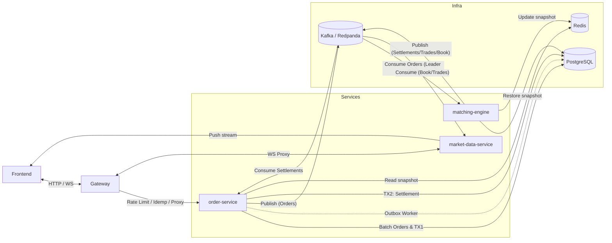

# 加密貨幣交易所後端 (Exchange Backend)

> 高效能、生產級的分散式撮合系統，以 Go 實作。涵蓋事件驅動架構、雙寫一致性保護、Active-Standby 高可用選主、極速批次寫入 (Ingestion Batching) 以及全面的 Prometheus 可觀測性監控。

[](https://golang.org/) [](./LICENSE)

---

## ✨ 核心技術亮點

| 特性                        | 實作說明                                                                                                                                                                                             |
| :-------------------------- | :--------------------------------------------------------------------------------------------------------------------------------------------------------------------------------------------------- |
| **Transactional Outbox**    | `PlaceOrder` 在同一個 DB Transaction 內同時寫入訂單與 Outbox 訊息。背景 Worker 使用 `SKIP LOCKED` 批次發送至 Kafka，確保 At-least-once 語意，消除雙寫風險。                                          |
| **Leader Election**         | 撮合引擎透過 PostgreSQL 的 `partition_leader_locks` 表競選 Leader（Upsert + WHERE 原子操作）。Fencing Token 單調遞增，防止腦裂（舊 Leader 復活的過期寫入會被 DB 拒絕），實現 Active-Standby 高可用。 |
| **事件驅動撮合**            | 下單 → Kafka → 撮合引擎 → 結算事件 → 結算服務。各服務解耦，可獨立水平擴展。                                                                                                                          |
| **極速批次寫入 (Batching)** | 提供專屬造市商 `/orders/batch`，底層整合 `pgx.CopyFrom` 與 `BatchLockFunds` (雙重記憶體排序完美防禦高併發死結)，繞開龐大連線開銷，展現數十倍吞吐量。                                                 |
| **架構級 K6 驗證**          | 不只流量盲測，設有涵蓋 E2E 延遲 (端到端)、Kafka Hash Routing 分區實證、以及讀寫資源隔離 (Market Storm) 的深度生產級壓測體系。                                                                        |
| **SRE 可觀測性**            | 全面實作 Google SRE 四大黃金信號 (Latency/Traffic/Errors/Saturation)；涵蓋 HTTP、Kafka、WebSocket、Leader 狀態等指標。Grafana Dashboard 支援腦裂告警。                                               |
| **分散式安全防護**          | API Gateway 使用 Redis Sliding Window 限流（精準區分公私有 API 之 Rate Limit）；`Idempotency-Key` 防重複下單；優雅轉換底層 Error 至標準 HTTP 狀態碼。                                                |

---

## 🏗️ 服務架構

本系統拆分為 **4 個獨立微服務**：

| 服務                    | 職責                                                                                                  |
| :---------------------- | :---------------------------------------------------------------------------------------------------- |
| **gateway**             | 對外統一入口、分散式限流、冪等性檢查、反向代理                                                        |
| **order-service**       | HTTP API (含造市商批次端點)、TX1（鎖資金 + 建單 + 寫 Outbox）、Outbox Worker、消費結算事件執行 TX2    |
| **matching-engine**     | Leader Election 選主、Cold-Start 快照還原、消費訂單事件、執行單執行緒精準撮合、發布結算/成交/行情事件 |
| **market-data-service** | 維護 WebSocket 長連線、消費 Kafka 事件並即時推播至千人前端                                            |



---

## 🛠️ 技術堆疊

| 分類         | 技術                                    |
| :----------- | :-------------------------------------- |
| **語言**     | Go 1.25                                 |
| **Web 框架** | Gin                                     |
| **訊息佇列** | Apache Kafka / Redpanda                 |
| **資料庫**   | PostgreSQL (pgx v5, pgxpool)            |
| **快取**     | Redis (go-redis v9)                     |
| **可觀測性** | Prometheus + Grafana                    |
| **壓測**     | k6 (包含自訂 Trend/Rate 專業指標)       |
| **容器化**   | Docker, Docker Compose                  |
| **部署**     | AWS ECS (Fargate), Terraform, ECSPresso |

---

## 🚀 快速啟動

### 前置需求

- Go 1.24+
- Docker & Docker Compose
- Make

### 本地開發

```bash
# 1. 啟動所有基礎設施 (PostgreSQL / Redis / Kafka / Prometheus / Grafana)
make up

# 2. 啟動所有微服務（支援 Hot Reload）
make dev

# 3. 執行資料庫 Migration (清空並重建 schema: make db-fresh)
make db-migrate
```

服務端點：

| 服務               | 位址                                       |
| :----------------- | :----------------------------------------- |
| Gateway (API 入口) | `http://localhost:8100`                    |
| API 文件 (Swagger) | `http://localhost:8100/swagger/index.html` |
| Prometheus         | `http://localhost:9090`                    |
| Grafana            | `http://localhost:3000`                    |

### 測試開發

```bash
# 單元與整合測試
make test

# K6 壓力測試與架構驗證 (需先啟動壓測用 Docker 環境)
make test-up           # 啟動壓測獨立環境
make test-smoke        # 端到端業務巡檢
make test-e2e-latency  # 事件溯源端到端真實延遲驗證
make test-market-storm # 讀寫隔離與 WebSocket Fanout 極限測試
make test-down         # 關閉壓測環境
```

_(更多深入的 K6 架構驗證劇本，請參考 `scripts/k6/README.md`)_

---

## 📂 專案結構

```
.
├── cmd/
│   ├── gateway/             # 對外 API 閘道
│   ├── order-service/       # 訂單服務（含 Outbox Worker）
│   ├── matching-engine/     # 撮合引擎（含 Leader Election）
│   └── market-data-service/ # 行情推播服務（WebSocket）
├── internal/
│   ├── api/                 # HTTP Handlers
│   ├── core/                # 核心邏輯（撮合引擎演算法）
│   ├── infrastructure/
│   │   ├── db/              # 資料庫連線池調優 (DBConfig) 與 TxKey
│   │   ├── election/        # Leader Election（防腦裂機制）
│   │   ├── kafka/           # Kafka Producer & Consumer
│   │   ├── metrics/         # Prometheus 指標收集
│   │   ├── outbox/          # Transactional Outbox Worker
│   │   └── redis/           # Redis 分散式限流
│   ├── middleware/          # Rate Limiter、Idempotency、JWT
│   └── repository/          # Batch Ingestion、PostgreSQL & Redis DAO
├── deploy/                  # Terraform AWS、ECSPresso 配置
├── sql/                     # Schema 與 Migrations
├── scripts/k6/              # 架構驗證級別壓測腳本
├── docs/                    # 面試 Q&A、STAR 案例與開發規格
└── Makefile                 # CI/CD 各類腳本入口
```

---

## 📊 可觀測性指標

系統所有服務均暴露 `/metrics` 端點，Prometheus 自動抓取。關鍵指標包含：

- `exchange_http_requests_total` — HTTP 請求量
- `exchange_order_duration_seconds` — 內部處理延遲 Histogram
- `exchange_outbox_pending_count` — Kafka 斷線積壓背壓 (Backpressure)
- `exchange_is_partition_leader` — 各節點的 Leader 狀態監控 (腦裂告警)

---

## 📄 授權

本專案以 [MIT License](./LICENSE) 授權開放原始碼。
