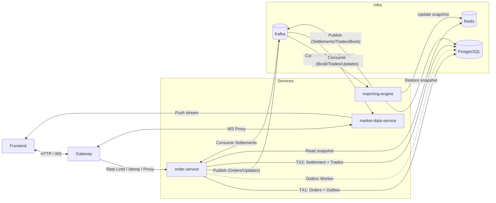

# 加密貨幣交易所後端 (Exchange Backend)

> 高效能、生產級的分散式撮合系統，以 Go 實作。涵蓋事件驅動架構、雙寫一致性保護、Active-Standby 高可用選主，以及全面的 Prometheus 可觀測性監控。

[](https://golang.org/) [](./LICENSE)

---

## ✨ 核心技術亮點

| 特性                     | 實作說明                                                                                                                                                                                             |
| :----------------------- | :--------------------------------------------------------------------------------------------------------------------------------------------------------------------------------------------------- |
| **Transactional Outbox** | `PlaceOrder` 在同一個 DB Transaction 內同時寫入訂單與 Outbox 訊息。背景 Worker 使用 `SKIP LOCKED` 批次發送至 Kafka，確保 At-least-once 語意，消除雙寫風險。                                          |
| **Leader Election**      | 撮合引擎透過 PostgreSQL 的 `partition_leader_locks` 表競選 Leader（Upsert + WHERE 原子操作）。Fencing Token 單調遞增，防止腦裂（舊 Leader 復活的過期寫入會被 DB 拒絕），實現 Active-Standby 高可用。 |
| **事件驅動撮合**         | 下單 → Kafka → 撮合引擎 → 結算事件 → 結算服務。各服務解耦，可獨立水平擴展。                                                                                                                          |
| **SRE 可觀測性**         | 全面實作 Google SRE 四大黃金信號 (Latency/Traffic/Errors/Saturation)；涵蓋 HTTP、Kafka、WebSocket、PostgreSQL、Redis、Outbox 積壓量、Leader 狀態等指標。Grafana Dashboard 支援腦裂告警。             |
| **分散式安全防護**       | API Gateway 使用 Redis Sliding Window 限流（公開 API 60次/分、私有 API 100次/秒）；`Idempotency-Key` 防重複下單；JWT 認證隔離公私端點。                                                              |

---

## 🏗️ 服務架構

本系統拆分為 **4 個獨立微服務**：

| 服務                    | 職責                                                                                  |
| :---------------------- | :------------------------------------------------------------------------------------ |
| **gateway**             | 對外統一入口、分散式限流、冪等性檢查、反向代理                                        |
| **order-service**       | HTTP API、TX1（鎖資金 + 建單 + 寫 Outbox）、Outbox Worker、消費結算事件執行 TX2       |
| **matching-engine**     | Leader Election 選主、Cold-Start 快照還原、消費訂單事件、執行撮合、發布結算/成交/行情 |
| **market-data-service** | 維護 WebSocket 長連線、消費 Kafka 事件並即時推播前端                                  |



---

## 🛠️ 技術堆疊

| 分類         | 技術                         |
| :----------- | :--------------------------- |
| **語言**     | Go 1.25                      |
| **Web 框架** | Gin                          |
| **訊息佇列** | Apache Kafka / Redpanda      |
| **資料庫**   | PostgreSQL (pgx v5, pgxpool) |
| **快取**     | Redis (go-redis v9)          |
| **可觀測性** | Prometheus + Grafana         |
| **壓測**     | k6                           |
| **容器化**   | Docker, Docker Compose       |
| **部署**     | Kubernetes (k3s), AWS EKS    |

---

## 🚀 快速啟動

### 前置需求

- Go 1.24+
- Docker & Docker Compose
- Make

### 本地開發

```bash
# 1. 啟動所有基礎設施 (PostgreSQL / Redis / Kafka / Prometheus / Grafana)
make up

# 2. 啟動所有微服務（支援 Hot Reload）
make dev

# 3. 執行資料庫 Migration
make db-refresh
```

服務端點：

| 服務               | 位址                                       |
| :----------------- | :----------------------------------------- |
| Gateway (API 入口) | `http://localhost:8082`                    |
| API 文件 (Swagger) | `http://localhost:8080/swagger/index.html` |
| Prometheus         | `http://localhost:9090`                    |
| Grafana            | `http://localhost:3000`                    |

### 測試

```bash
# 單元與整合測試
make test

# 測試覆蓋率報告
make test-coverage

# k6 壓力測試 (需先啟動環境)
make test-env      # 啟動壓測專用環境
make stress-test   # 執行全套壓測場景
```

---

## 📂 專案結構

```
.
├── cmd/
│   ├── gateway/             # 對外 API 閘道
│   ├── order-service/       # 訂單服務（含 Outbox Worker）
│   ├── matching-engine/     # 撮合引擎（含 Leader Election）
│   └── market-data-service/ # 行情推播服務（WebSocket）
├── internal/
│   ├── api/                 # HTTP Handlers & WebSocket
│   ├── core/                # 核心業務邏輯（撮合引擎、服務層）
│   ├── infrastructure/
│   │   ├── election/        # Leader Election（選主 + 防腦裂）
│   │   ├── kafka/           # Kafka Producer & Consumer
│   │   ├── metrics/         # Prometheus 指標定義
│   │   ├── outbox/          # Transactional Outbox（Model/Repo/Worker）
│   │   └── redis/           # Redis Client
│   ├── middleware/          # 限流、冪等性、JWT
│   └── repository/          # PostgreSQL & Redis 資料存取層
├── sql/
│   ├── schema.sql           # 主資料庫 Schema
│   └── migrations/          # 增量 Migration SQL
├── docs/
│   ├── guides/              # 微服務教學、操作指南
│   ├── interview/           # 面試 Q&A、STAR 案例
│   └── testing/             # 壓測結果與分析
└── deploy/                  # Kubernetes & Docker Compose 配置
```

---

## 📊 可觀測性指標

系統所有服務均暴露 `/metrics` 端點，Prometheus 自動抓取。關鍵指標包含：

- `exchange_http_requests_total` — HTTP 請求量（依 Method/Path/Status 分組）
- `exchange_order_duration_seconds` — 下單延遲 Histogram（P50/P95/P99）
- `exchange_outbox_pending_count` — Outbox 積壓量（此值持續高表示 Kafka 斷線）
- `exchange_is_partition_leader` — 各節點的 Leader 狀態（所有節點加總 > 1 代表腦裂）
- `exchange_leader_lease_renewals_total` — Leader 租約延長次數（error 飆升代表 DB 不穩）

---

## 📄 授權

本專案以 [MIT License](./LICENSE) 授權開放原始碼。
