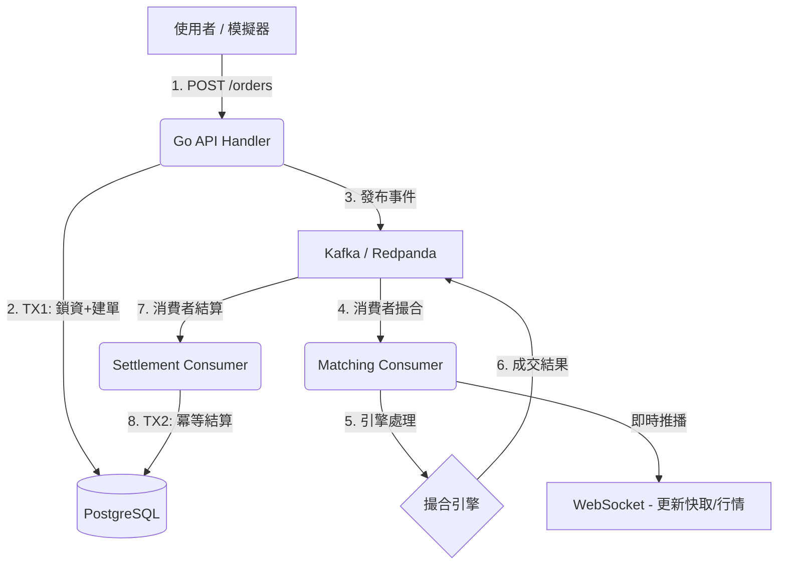

# Go Exchange System

這是一個用 Go 語言實作的高效能、分散式加密貨幣/股票撮合系統。本專案旨在展示分散式系統設計、微服務架構以及雲端原生部署的最佳實踐。

## 🚀 專案狀態

**Phase 5: 事件驅動架構 (Event-Driven Architecture) 已完成** ✅

專案已從單體同步架構升級為基於 Kafka 的非同步事件驅動架構。

### 已實作功能
- **事件驅動下單流程**:
  - API 接收訂單後發布事件至 Kafka，由 Matching Consumer 非同步處理撮合。
  - 撮合結果發布 Settlement 事件，由 Settlement Consumer 執行冪等資料庫結算。
- **高可用性與擴展性**:
  - 支援 Redpanda (Kafka 兼容) 動態擴展。
  - 同一交易對 (Symbol) 的訂單與撤單事件透過 Partition Key 保證嚴格有序。
- **核心撮合引擎**: 
  - 支援 **價格優先 + 時間優先 (Price-Time Priority)** 撮合演算法。
  - 支援 **Limit & Market Order**。
  - 支援 **部分成交 (Partial Fills)** 與 **連續撮合**。
- **資金安全與冪等性**:
  - 原子化結算事務 (Atomic settlement transactions)。
  - 基於成交 ID 的結算冪等性檢查，防止重複入帳。

---


## 🛠️ 技術堆疊

- **Language**: Go 1.25
- **Web Framework**: [Gin](https://github.com/gin-gonic/gin)
- **Messaging**: [Kafka / Redpanda](https://redpanda.com/)
- **Database**: PostgreSQL (pgx driver)
- **Cache**: Redis
- **Decimal Types**: [shopspring/decimal](https://github.com/shopspring/decimal) (高精度金額計算)
- **Infrastructure**: Docker, Docker Compose

---

## 🏃 如何開始

### 前置需求
- Go 1.25
- Docker & Docker Compose
- Make

### 快速啟動 (Local Development)

1. **啟動基礎設施 (PostgreSQL, Redis, Kafka)**
   ```bash
   make up
   ```

2. **執行 Database Migration**
   ```bash
   make db-refresh
   ```

3. **啟動 API Server**
   ```bash
   make run
   ```
   Server 將啟動於 `http://localhost:8080`，並自動連接 Kafka 消費者。

### 執行測試

本專案高度重視測試，您可以執行以下指令來驗證系統：

```bash
# 執行所有測試
make test

# 執行測試並查看覆蓋率報告
make test-coverage
```

### 測試 API

您可以使用單一 k6 smoke test 快速驗證 API 可用性：
```bash
make smoke-test
```

若尚未安裝 k6：
```bash
brew install k6
```

---

## 📂 專案結構 (Phase 1)

```
.
├── cmd/
│   └── server/       # 應用程式進入點
├── internal/
│   ├── api/          # HTTP Handlers (Gin)
│   ├── core/         # 核心業務邏輯 (Service, Domain Models)
│   ├── matching/     # 撮合引擎邏輯 (OrderBook, Engine)
│   └── repository/   # 資料存取層 (PostgreSQL implementation)
├── sql/              # SQL Migrations
└── docs/             # 專案文檔
```

## 📅 未來規劃 (Roadmap)

- **Phase 1: 單體 MVP (Completed)**
- **Phase 2: 微服務拆分** (Next)
  - 拆分為 Order Service, Matching Service, Account Service
  - 引入 gRPC 進行服務間通訊
- **Phase 3: 分散式架構優化**
  - 引入 Kafka 進行異步撮合與結算
  - 實作 CQRS
  - 詳細架構升級請參考 [大流量處理改善方案](docs/HIGH_THROUGHPUT_IMPROVEMENT_PLAN.md)
- **Phase 4: Kubernetes 部署與高可用性**
  - 部署至 AWS EKS
  - 實作防禦性編程 (冪等性、限流、熔斷)
  - 詳細可靠性計畫請參考 [高可用性與高可靠性改善方案](docs/HIGH_AVAILABILITY_IMPROVEMENT_PLAN.md)

詳細規劃請參考 [專案規劃書](docs/PROJECT_PLAN.md)。
