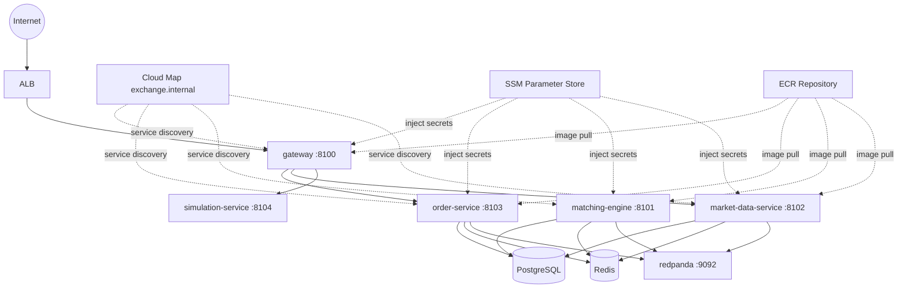

# Infrastructure Deployment

本目錄是現行 AWS ECS 微服務部署入口。除 `deploy/ecspresso/monolith/` 仍保留為歷史拆分參考外，其餘 Terraform、ecspresso 與操作文件均以 `gateway`、`order-service`、`matching-engine`、`market-data-service` 的 per-service 部署模型為準。

## 文件導覽

| 文件 | 用途 | 何時閱讀 |
|------|------|----------|
| [01-QUICKSTART.md](./docs/01-QUICKSTART.md) | 首次建立 staging 微服務環境 | 第一次部署前 |
| [02-DAILY-WORKFLOW.md](./docs/02-DAILY-WORKFLOW.md) | 日常 build、deploy、rollback、log 查詢 | 日常維運 |
| [03-TEARDOWN.md](./docs/03-TEARDOWN.md) | 完整刪除 ECS 與 Terraform 資源 | 測試結束或節省費用 |
| [04-ECS-MICROSERVICES-EXECUTION-CHECKLIST.md](./docs/04-ECS-MICROSERVICES-EXECUTION-CHECKLIST.md) | ECS 重整任務清單與完成定義 | 追蹤進度 |
| [05-CURRENT-SERVICE-CONTRACT.md](./docs/05-CURRENT-SERVICE-CONTRACT.md) | 微服務拓樸、SSM、Cloud Map、內部 DNS 契約 | 對齊部署參數 |
| [06-STAGING-VALIDATION-RUNBOOK.md](./docs/06-STAGING-VALIDATION-RUNBOOK.md) | staging 驗證順序、測試 gate 與證據清單 | 部署驗收前 |
| [07-PRODUCTION-READY-BACKLOG.md](./docs/07-PRODUCTION-READY-BACKLOG.md) | production-ready backlog、go / no-go gate | staging 驗證後 |
| [08-IAC-AND-ECSPRESSO-GUIDE.md](./docs/08-IAC-AND-ECSPRESSO-GUIDE.md) | Terraform 與 ecspresso 的分工、參數來源與部署機制 | 需要理解整體 deploy stack 時 |
| [09-STAGING-FIRST-DEPLOY-TROUBLESHOOTING.md](./docs/09-STAGING-FIRST-DEPLOY-TROUBLESHOOTING.md) | 首輪 staging 部署實際故障、根因與修復紀錄 | 首次部署失敗或需要復盤時 |
| [10-MANUAL-ZERO-COST-DELETION-CHECKLIST.md](./docs/10-MANUAL-ZERO-COST-DELETION-CHECKLIST.md) | 手動刪除資源時的零費用清單、驗證順序與殘留盤點 | Terraform state drift 或手動清除時 |

## 建議閱讀順序

1. 先看 `04-ECS-MICROSERVICES-EXECUTION-CHECKLIST.md`，確認目前 issue 階段。
2. 再看 `05-CURRENT-SERVICE-CONTRACT.md`，對齊服務 port、SSM 與 service discovery 契約。
3. 第一次部署時照 `01-QUICKSTART.md` 操作。
4. 部署完成後，依 `06-STAGING-VALIDATION-RUNBOOK.md` 做驗收。
5. 若首次部署失敗，優先對照 `09-STAGING-FIRST-DEPLOY-TROUBLESHOOTING.md`。
6. 若已手動刪除部分 AWS 資源，改看 `10-MANUAL-ZERO-COST-DELETION-CHECKLIST.md`。
7. 若需要理解 Terraform 與 ecspresso 的責任邊界，再看 `08-IAC-AND-ECSPRESSO-GUIDE.md`。
8. 完成驗收後，依 `07-PRODUCTION-READY-BACKLOG.md` 排下一輪強化工作。

## 架構概覽



## 目錄結構

```text
deploy/
├── terraform/
│   ├── bootstrap/               # 建立 S3 remote state bucket 與 DynamoDB lock table
│   ├── modules/
│   │   ├── network/
│   │   ├── container/
│   │   ├── data/
│   │   ├── messaging/
│   │   └── alb/
│   └── environments/
│       └── staging/
├── ecspresso/
│   ├── gateway/
│   ├── order-service/
│   ├── matching-engine/
│   ├── market-data-service/
│   └── monolith/               # legacy，僅供歷史參考
└── docs/
    ├── 01-QUICKSTART.md
    ├── 02-DAILY-WORKFLOW.md
    ├── 03-TEARDOWN.md
    ├── 04-ECS-MICROSERVICES-EXECUTION-CHECKLIST.md
    ├── 05-CURRENT-SERVICE-CONTRACT.md
    ├── 06-STAGING-VALIDATION-RUNBOOK.md
    └── 07-PRODUCTION-READY-BACKLOG.md
```

## 常用 Makefile 入口

| 目的 | 指令 |
|------|------|
| 啟用 remote state bootstrap | `make bootstrap-init && make bootstrap-plan && make bootstrap-apply` |
| 初始化 / 預覽 / 套用 staging infra | `make infra-init` / `make infra-plan` / `make infra-apply` |
| 顯示 ALB、API、WS 入口 | `make show-staging-outputs` |
| 推送單一服務鏡像 | `make docker-build-push ECS_SERVICE=order-service IMAGE_TAG=<tag>` |
| 推送四個核心服務鏡像 | `make docker-build-push-core IMAGE_TAG=<tag>` |
| 首次建立四個核心服務 | `make ecs-create-core IMAGE_TAG=<tag>` |
| 依序更新四個核心服務 | `make ecs-deploy-core IMAGE_TAG=<tag>` |
| 檢查四個核心服務狀態 | `make ecs-status-all` |
| 執行 staging baseline | `make staging-baseline-test` |
| 執行 WebSocket 驗證 | `make staging-ws-validation` |
| 完整刪除環境 | `make destroy-all CONFIRM=1` |

## 設計原則

| 決策 | 理由 |
|------|------|
| Terraform 管基礎設施 | VPC、ALB、RDS、Redis、ECS Cluster、Cloud Map 與 SSM 需有明確 state 管理 |
| ecspresso 管服務部署 | task/service definition 與 image tag 更新頻率高，適合與 infra state 解耦 |
| Redpanda 保持單節點 staging | 先驗證應用鏈路與運維成本，再評估 HA 或 managed Kafka |
| SSM Parameter Store 注入敏感資訊 | 避免把連線字串散落在多份部署檔案 |
| gateway 是唯一對外 Target Group | 首輪先收斂單一入口，降低 ALB 與路由複雜度 |

## 備註

- `simulation-service` 目前不在首輪 blocking scope，文件與 Makefile 以四個核心服務為主。
- `deploy/ecspresso/monolith/` 與 legacy monolith 文件仍保留，但不再是現行 deploy 路徑。
- 若 staging 已切到 S3 backend，請避免再使用 local `terraform.tfstate` 作為部署來源。

