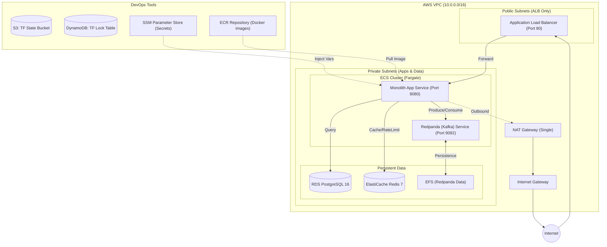

# Infrastructure Deployment

## 📚 詳細文件

| 文件 | 說明 |
|------|------|
| [01-QUICKSTART.md](./docs/01-QUICKSTART.md) | 首次完整部署逐步指南 |
| [02-DAILY-WORKFLOW.md](./docs/02-DAILY-WORKFLOW.md) | 日常更新程式碼、查 log、回滾 |
| [03-TEARDOWN.md](./docs/03-TEARDOWN.md) | ⚠️ **完整清除所有資源（避免漏費）** |

---

## 架構概覽



## 📂 目錄結構

```
deploy/
├── terraform/
│   ├── modules/
│   │   ├── network/     ← VPC、子網路、NAT Gateway、安全群組
│   │   ├── container/   ← ECR、ECS Cluster、IAM Role、CloudWatch Logs
│   │   ├── data/        ← RDS PostgreSQL 16 + ElastiCache Redis 7
│   │   ├── messaging/   ← Redpanda (Kafka) on ECS + EFS 持久化
│   │   └── alb/         ← Application Load Balancer + Target Group
│   └── environments/
│       └── staging/     ← 組合所有模組的根模組
└── ecspresso/
    └── monolith/        ← ECS Service + Task Definition（CI 管理 image tag）
```

## 設計原則

| 決策 | 理由 |
|------|------|
| **Terraform = 基礎設施層** | VPC/RDS/Redis/ALB/ECS Cluster — 改動頻率低，需要 state 管理 |
| **ecspresso = 部署層** | ECS Service + Task Def — image tag 由 CI 動態替換，不鎖 Terraform state |
| **Redpanda on ECS（非 MSK）** | ~$10-15/月 vs MSK $200+/月；franz-go 完全相容；與本地 docker-compose 一致 |
| **SSM Parameter Store** | 機敏值不進 Terraform state 明文；ECS 啟動時動態注入 |
| **單 NAT Gateway** | staging 節省費用（production 可改為每 AZ 一個）|

## 首次部署流程

### 前置條件
- AWS CLI 已設定（`aws configure`）
- Terraform >= 1.6（`brew install terraform`）
- ecspresso（`brew install ecspresso`，或參考 [ecspresso releases](https://github.com/kayac/ecspresso/releases)）

### 步驟 1：初始化 Terraform

```bash
cd deploy/terraform/environments/staging
cp terraform.tfvars.example terraform.tfvars
# 編輯 terraform.tfvars，填入 db_password
terraform init
```

### 步驟 2：啟用 S3 Remote State（建議）

```bash
# 先建立 S3 bucket 和 DynamoDB lock table
aws s3 mb s3://exchange-terraform-state --region ap-northeast-1
aws s3api put-bucket-versioning \
  --bucket exchange-terraform-state \
  --versioning-configuration Status=Enabled
aws dynamodb create-table \
  --table-name exchange-terraform-locks \
  --attribute-definitions AttributeName=LockID,AttributeType=S \
  --key-schema AttributeName=LockID,KeyType=HASH \
  --billing-mode PAY_PER_REQUEST \
  --region ap-northeast-1

# 取消 main.tf 中 backend "s3" {} 的註解，然後：
terraform init -reconfigure
```

### 步驟 3：部署基礎設施

```bash
terraform plan    # 確認要建立的資源
terraform apply   # 實際建立（約 15-20 分鐘，RDS 最慢）
```

### 步驟 4：部署 monolith 應用程式

```bash
# 取得 ECR URL
ECR_URL=$(terraform output -raw ecr_repository_url)

# Build & Push image
cd ../../..  # 回到 backend/
aws ecr get-login-password --region ap-northeast-1 | \
  docker login --username AWS --password-stdin $ECR_URL

docker build -t $ECR_URL:latest .
docker push $ECR_URL:latest

# 用 ecspresso 建立/更新 ECS Service
cd deploy/ecspresso/monolith
ECR_IMAGE=$ECR_URL:latest ecspresso create   # 首次建立
# 或
ECR_IMAGE=$ECR_URL:latest ecspresso deploy   # 後續更新
```

### 步驟 5：驗證部署

```bash
ALB_DNS=$(cd ../../terraform/environments/staging && terraform output -raw alb_dns_name)

# 健康檢查
curl http://$ALB_DNS/health
# 預期：{"status":"ok"}

# 查看 logs
aws logs tail /ecs/exchange/staging/monolith --follow
```

## 常用維運指令

```bash
# ECS Exec（進入容器除錯）
aws ecs execute-command \
  --cluster exchange-staging \
  --task <task-id> \
  --container monolith \
  --interactive \
  --command "/bin/sh"

# 查看 Redpanda logs
aws logs tail /ecs/exchange/staging/redpanda --follow

# 僅更新 image（不動基礎設施）
ECR_IMAGE=$ECR_URL:$GIT_SHA ecspresso deploy

# Terraform 查看 state
terraform state list
terraform output
```

## 注意事項

- `terraform.tfvars` 已加入 `.gitignore`，**請勿提交到 Git**
- Redpanda desiredCount 固定為 1（有狀態服務，不支援水平擴展）
- staging 的 RDS 設定 `skip_final_snapshot = true`，**刪除前資料不會保留**
- ElastiCache 使用 TLS（`rediss://`），確認 Go 客戶端設定 `tls.Config{}` 或 `true`

---

## 💣 踩坑紀錄與常見問題 (Troubleshooting)

在實際架設與銷毀 AWS 雲端環境時，我們曾遇到以下狀況與對應的解法：

### 1. Terraform Destroy 卡死 (RepositoryNotEmptyException)
**問題**：執行 `make destroy-all` 時，Terraform 無法刪除 ECR Repository，出現：`RepositoryNotEmptyException: The repository with name 'monolith' in registry ... cannot be deleted because it still contains images`。
**解法**：
1. 在 Terraform `modules/container/main.tf` 中將 ECR 的屬性設為 `force_delete = true`。
2. **一定要先執行 `terraform apply`** 將這個屬性更新至 AWS 後，再執行 `terraform destroy`，才能無視映像檔庫內的殘留檔案強制刪除。

### 2. Terraform State 被鎖住 (Error acquiring the state lock)
**問題**：因為 Terraform `apply` 或 `destroy` 執行到一半被中斷 (例如因為網路變數被刪導致卡住按 Ctrl+C)，再次執行時出現 `Error message: resource temporarily unavailable` 且帶有一個 Lock ID。
**解法**：手動強制解鎖。執行：
```bash
terraform force-unlock -force <Lock-ID>
```

### 3. ecspresso delete 卡住 (Service cannot be stopped while it is scaled above 0)
**問題**：刪除環境時出現 `InvalidParameterException: The service cannot be stopped while it is scaled above 0.` 因為先被刪除了子網路或 Security Group 導致 ECS Task 無法啟動或終止，陷入無限迴圈無法 Scale Down。
**解法**：
1. Terraform 管理基礎設定，ecspresso 管理部署任務（解耦雙面刃：銷毀時可能會有順序競爭）。
2. 將 `aws ecs update-service --desired-count 0` 與 `aws ecs delete-service --force` 作為強力手段。
3. `make destroy-all` 會先執行 `ecspresso delete --force`，再執行 `terraform destroy`。如果 ecspresso 報錯但其實叢集即將被 Terraform 整個摧毀，可以使用 `-` 忽略該錯誤並讓 Terraform 繼續刪除叢集。

### 4. 手動清理 AWS 殘餘資源的優先順序
**問題**：當 Terraform 或 ecspresso 因依賴關係而無法完全自動銷毀環境時，手動清理的正確順序為何？
**解法**：為確保清理最完整且不遺留計費資源，請遵循以下「由內而外」的順序：
1. **ECS**：先刪除 **Service** (需手動 Stop Tasks)，再刪除 **Cluster**。這是解決 `ClusterContainsServicesException` 的核心。
2. **計費實例**：刪除 **RDS (Database)**、**ElastiCache (Redis)**。刪除 RDS 時請勾選「不建立 Final Snapshot」。
3. **網路依賴**：刪除 **ALB (Load Balancer)** 與 **NAT Gateway**。NAT Gateway 刪除通常需要 3-5 分鐘。
4. **最後防線**：當上述資源消失後，直接刪除自定義的 **VPC**。AWS 會嘗試合併刪除 Subnets, IGW 與 Route Tables。
5. **其餘殘骸**：檢查並手動刪除 **CloudWatch Log Groups** (尤其是 `/aws/ecs/containerinsights/...`)、**ECR Repositories** 與 **EFS File Systems**。
6. **本地歸零**：雲端清空後，執行 `terraform destroy -auto-approve -refresh=false` 強制抹除本地 state 記錄。

### 5. 辨識 AWS 預設資源 (不需刪除)
**問題**：在後台看到很多不認得的資源（如預設 VPC、Option Groups、Users），是否也需要刪除？
**解法**：
- **Default VPC** (172.31.0.0/16)：AWS 帳號預設資源，**留著不會扣錢**。
- **RDS Option Groups** (`default:postgres-16`)：系統預設範本，**留著不會扣錢**。
- **ElastiCache Users** (`default`)：Redis 系統帳號，**不可刪除且免費**。
- **RDS Events / Logs**：唯讀的操作日誌，**14天後自動消失且免費**。
- **ECS Task Definitions**：部署藍圖/版本記錄，**不佔空間且不收費**。

