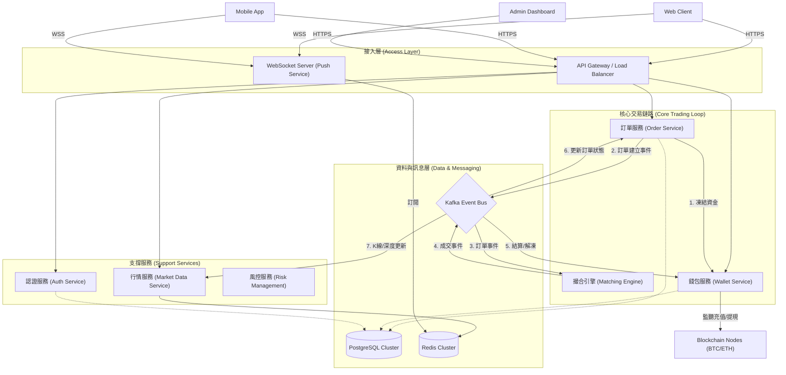
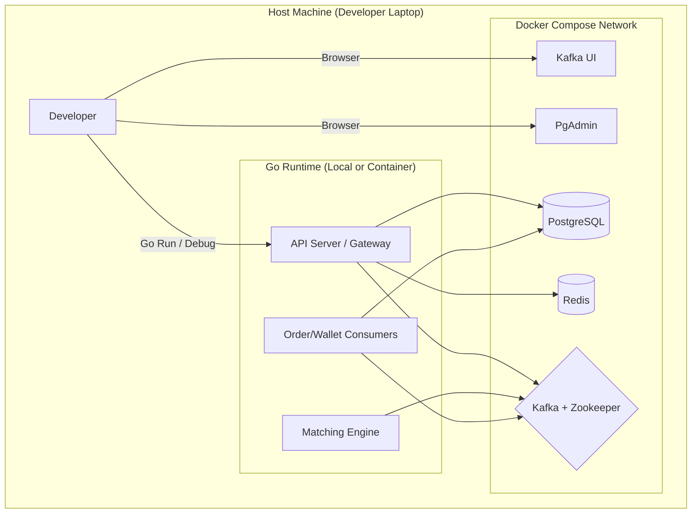
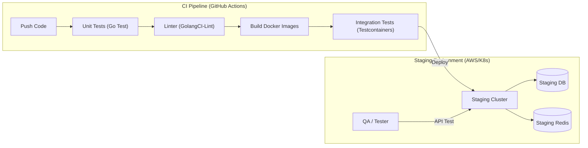
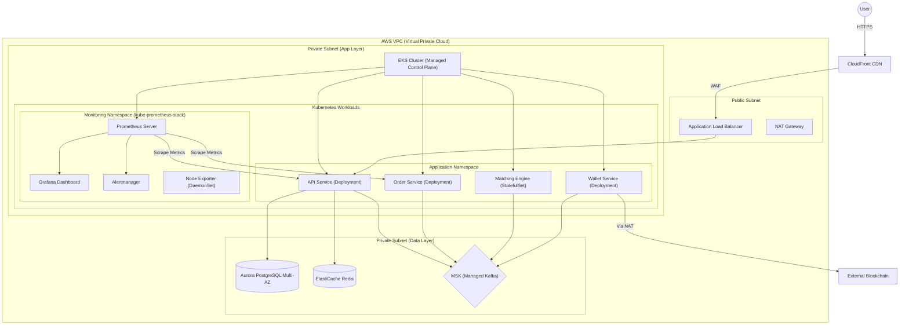

# System Design & Architecture

這份文件詳細描述了加密貨幣交易所 (Crypto Exchange) 的系統架構設計，包含功能架構與各環境的部署架構。

## 1. 功能架構圖 (Functional Architecture)

這張圖展示了交易所的核心功能模組，強調微服務拆分與事件驅動設計。

### 核心模組功能說明

1.  **接入層 (Access Layer)**

    - **API Gateway**: 負責請求路由、API Key 驗證、Rate Limiting (限流)、CORS 處理。
    - **WebSocket Server**: 負責高頻率的資料推送，包含即時成交 (Trades)、訂單簿 (OrderBook)、K 線 (Candles)。

2.  **核心交易鏈路 (Core Trading Loop)**

    - **Order Service (訂單服務)**:
      - 接收用戶下單 (Limit/Market) 與撤單請求。
      - 維護訂單狀態 (New, Partial, Filled, Canceled)。
      - **關鍵職責**: 確保訂單寫入 DB 後才發送事件，保證不掉單。
    - **Matching Engine (撮合引擎)**:
      - **核心中的核心**。全記憶體 (In-Memory) 運作，追求極致效能。
      - 維護每個交易對 (Symbol) 的訂單簿 (OrderBook)。
      - 輸出成交配對結果 (Matches)。
    - **Wallet Service (錢包服務)**:
      - 管理用戶資產餘額 (Available vs Locked)。
      - 處理充值 (Deposit) 與提現 (Withdrawal) 的區塊鏈互動。
      - **關鍵職責**: 確保帳務絕對準確 (Double Entry Bookkeeping)。

3.  **支撐服務 (Support Services)**

    - **Market Data Service**: 訂閱成交事件，聚合生成 OHLCV (K 線) 數據，維護 24h 漲跌幅。
    - **Risk Service**: 風控系統，監控異常交易、大額提現、洗錢防制 (AML)。

4.  **基礎設施 (Infrastructure)**
    - **Kafka**: 事件驅動的核心，解耦「下單」與「撮合」，實現流量削峰填谷。
    - **Redis**: 快取熱點資料 (Token, User Profile) 與 Pub/Sub 訊息通道。
    - **PostgreSQL**: 關聯式資料庫，儲存所有關鍵業務數據。

---

## 2. 本地開發環境架構 (Local Development Environment)

本地開發主要依賴 Docker Compose 來快速啟動基礎設施，開發者可以在本機直接運行 Go 服務或將其容器化。

### 本地環境特點

- **全端模擬**: 使用 Docker Compose 一鍵啟動所有依賴 (DB, Cache, MQ)。
- **開發便利**: Go 服務可直接在 IDE (VS Code) 中運行與除錯，連接 Docker 中的基礎設施。
- **可視化工具**: 內建 Kafka UI 與 PgAdmin，方便觀察資料流與 DB 狀態。

---

## 3. 測試環境架構 (Test Environment Architecture)

測試環境分為 CI/CD 自動化測試與 Staging 整合測試環境，確保程式碼品質與系統穩定性。

### 測試策略

1.  **單元測試 (Unit Test)**: 針對 Service 層與 Domain 層進行邏輯測試，使用 Mock 隔離外部依賴。
2.  **整合測試 (Integration Test)**: 使用 Testcontainers 啟動真實的 Postgres/Redis/Kafka 容器，驗證 Repository 層與訊息傳遞。
3.  **Staging 環境**: 部署至與生產環境相似的雲端環境，進行端對端 (E2E) 測試與壓力測試。

---

## 4. AWS 生產環境架構 (AWS Production Architecture)

生產環境採用高可用 (High Availability) 設計，基於 Amazon EKS (Elastic Kubernetes Service) 實現容器編排，並使用 kube-prometheus-stack 進行全面監控。

### 雲端架構亮點

- **Kubernetes 原生架構**:

  - **EKS Managed Control Plane**: AWS 託管的 Kubernetes 控制平面，免除 Master Node 維運負擔。
  - **Helm Charts**: 使用 Helm 管理應用部署，標準化部署流程。
  - **Namespace 隔離**: 應用與監控分離於不同 Namespace，提升安全性與可管理性。

- **可觀測性 (Observability) - kube-prometheus-stack**:

  - **Prometheus**: 自動發現 (ServiceMonitor) 並抓取所有服務的 `/metrics` 端點。
  - **Grafana**: 預建儀表板監控 Kubernetes 叢集狀態、應用效能 (QPS, Latency, Error Rate)。
  - **Alertmanager**: 整合 Slack/PagerDuty，即時告警異常狀態。
  - **Node Exporter**: 以 DaemonSet 形式部署，收集各節點系統指標。

- **高可用性 (HA)**:

  - 資料庫 (RDS) 與 訊息隊列 (MSK) 皆採用 Multi-AZ 部署。
  - EKS Worker Nodes 分散於多個可用區 (AZ)。
  - 使用 Pod Disruption Budget (PDB) 確保滾動更新時服務不中斷。

- **彈性擴展 (Auto Scaling)**:

  - **Horizontal Pod Autoscaler (HPA)**: 根據 CPU/Memory 或自訂指標自動調整 Pod 數量。
  - **Cluster Autoscaler**: 根據 Pending Pods 自動調整 Worker Node 數量。

- **安全性**:
  - **WAF**: 防禦 DDoS 與常見 Web 攻擊。
  - **Private Subnet**: 核心服務與資料庫不直接暴露於公網，僅透過 ALB 與 NAT Gateway 進出。
  - **IRSA (IAM Roles for Service Accounts)**: 細粒度的 Pod 級別權限控制。
  - **Network Policies**: 控制 Pod 間的網路流量。
