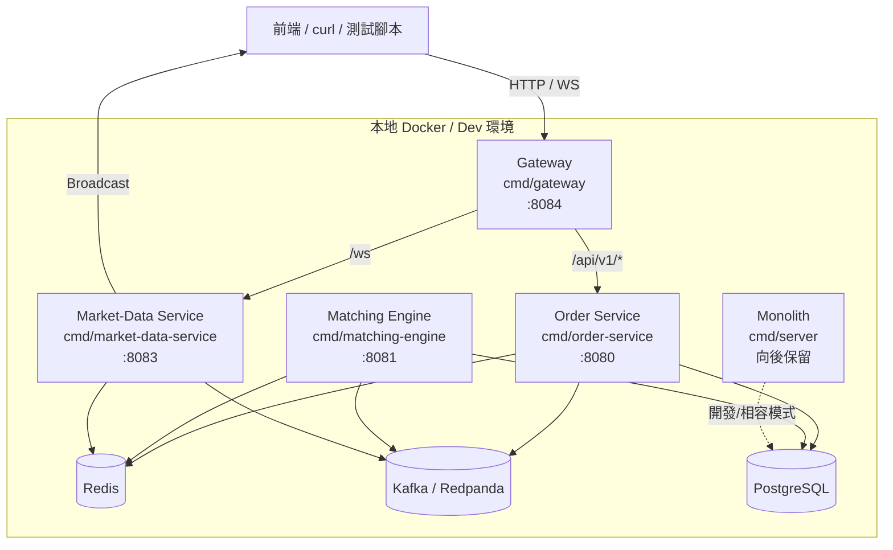
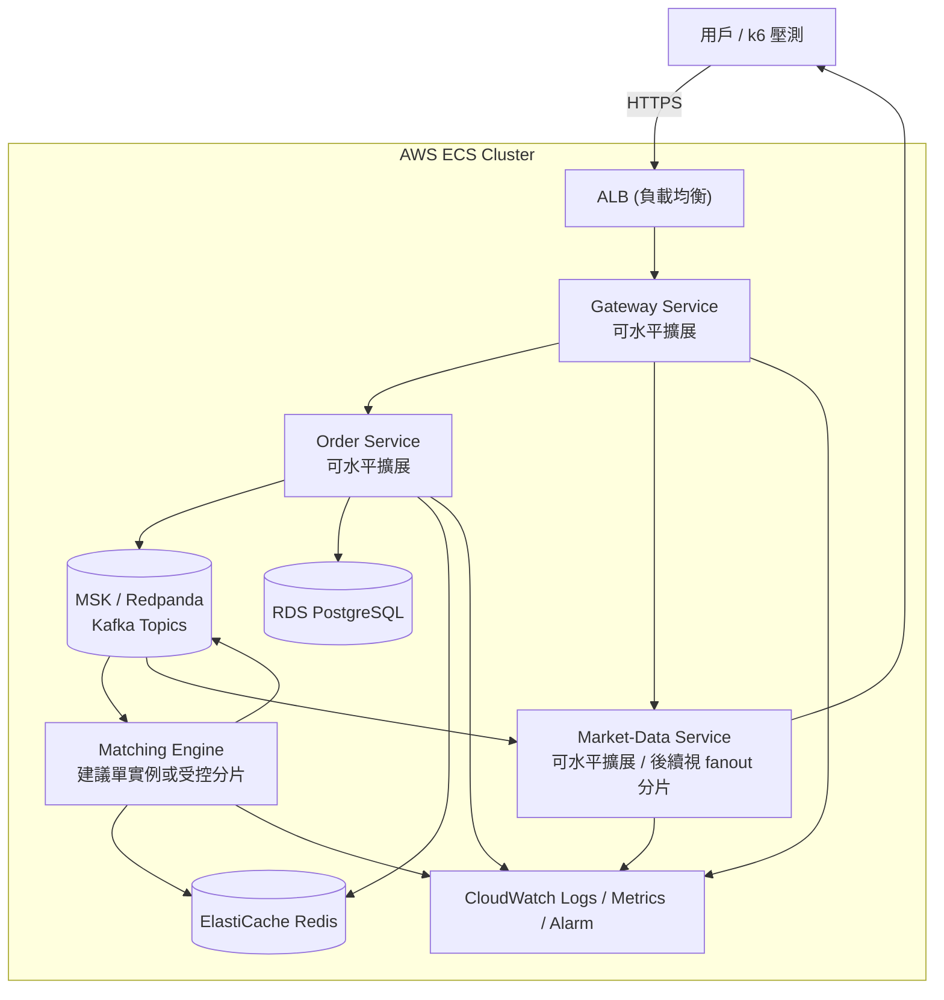
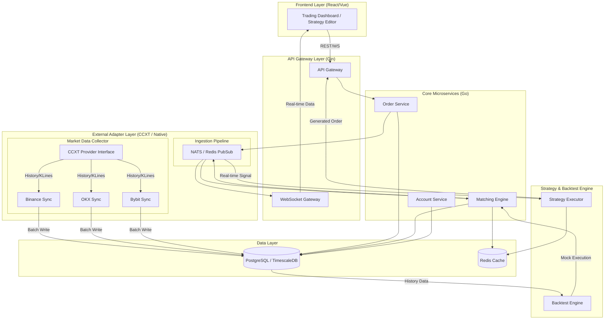

# 專案架構文件 (Architecture Document)

> **本文件為架構的唯一真相來源。** 記錄從目前本地微服務 MVP，到 ECS 壓測，再到最終 CCXT 多交易所平台的完整演進路徑。

---

## 0. 專案目標與演進路線

```
現在                              近期目標                      長期目標
────────────────────────────────────────────────────────────────────────────
本地微服務 MVP                → ECS 微服務部署 + 壓力測試     → CCXT 多交易所
+ Gateway / Order / Engine    → CloudWatch / ALB / Auto Scale → 策略回測平台
+ Market-Data + Redis/Kafka   → 驗證瓶頸與可靠性缺口          → TimescaleDB + NATS
```

### 三大階段說明

| 階段 | 狀態 | 核心目標 |
|------|------|----------|
| **Stage 1：現行單體** | ✅ 完成 | 撮合引擎 MVP，本地可用 |
| **Stage 2：非同步微服務 + ECS** | 🔄 進行中 | 已完成本地微服務 MVP，下一步是 ECS 部署、壓測、可靠性補強 |
| **Stage 3：CCXT 多交易所平台** | 📋 規劃 | 先做雙模式抽象與最小 PAPER mode，再決定真正的多交易所 data plane |

### 目前所在位置

- **目前狀態不是 Stage 1 單體，而是 Stage 2 的後半段。**
- 更精確地說，當前位置可視為 **Stage 2.5：本地微服務 MVP 已完成，雲端部署與壓測尚未完成**。
- 已完成的核心能力：
    - Gateway 負責 API 邊界、限流、冪等性、反向代理
    - Order Service 負責訂單 API 與訂單生命週期
    - Matching Engine 負責撮合與事件發布
    - Market-Data Service 負責 WebSocket 與行情事件扇出
    - Redis + Kafka 已納入本地微服務資料流
- 尚未完成的核心能力：
    - ECS / ALB / CloudWatch 的完整雲端驗證
    - k6 壓測與瓶頸分析
    - Outbox / DLQ / Replay / 觀測性 / 恢復流程等 production hardening

---

## 1. 當前架構：本地微服務 MVP (Current State - Stage 2.5 🔄)



**現行技術棧：**
- **API / Gateway**: Gin + Reverse Proxy
- **撮合引擎**: In-Memory OrderBook，Price-Time Priority
- **資料庫**: PostgreSQL（訂單、帳戶、成交記錄）
- **快取 / 保護層**: Redis（OrderBook 快取、Rate Limit、Idempotency）
- **事件匯流排**: Kafka / Redpanda（Orders / Settlements / Trades / OrderBook / OrderUpdates）
- **即時推送**: WebSocket (gorilla/websocket)，由 Market-Data Service 負責
- **日誌**: Uber Zap (結構化)
- **基礎設施 (IaC)**: Terraform + ecspresso

**目錄結構（現行）：**
```
backend/
├── cmd/gateway/          # API Gateway，負責限流/冪等性/路由/WS Proxy
├── cmd/order-service/    # 訂單 API 與訂單生命週期
├── cmd/matching-engine/  # 撮合與事件生產者
├── cmd/market-data-service/ # WebSocket 與行情事件扇出
├── cmd/server/           # 單體整合模式，向後保留
├── cmd/simulator/        # 壓測行情模擬器
├── internal/
│   ├── api/              # HTTP Handler 與路由註冊
│   ├── core/             # 領域邏輯、事件契約、Service、Matching
│   ├── core/matching/    # 撮合引擎核心：engine.go, orderbook.go
│   ├── middleware/       # Rate Limit / Idempotency / Validation 等邊界保護
│   ├── repository/       # PostgreSQL 存取層
│   ├── infrastructure/   # Kafka / Redis / Logger / 其他 Adapter
│   ├── simulator/        # 模擬下單 Service
│   └── ...
├── sql/                  # schema.sql, seed.sql
├── scripts/
│   └── k6/
│       └── ...           # k6 腳本與驗證工具
├── deploy/
│   ├── terraform/        # AWS 基礎設施與環境配置
│   └── ecspresso/        # ECS 服務與 Task Definition 管理
```

### 1.1 服務責任邊界

| 服務 | 當前責任 | 不負責的事 |
|------|----------|------------|
| **Gateway** | 對外入口、Rate Limit、Idempotency、HTTP/WS Proxy | 不負責撮合、不直接操作資料庫 |
| **Order Service** | 下單/撤單 API、訂單查詢、狀態流轉、資料持久化 | 不負責 WebSocket 扇出 |
| **Matching Engine** | 讀取訂單事件、撮合、產生 trade/orderbook/order-updates 事件 | 不對外暴露主要 API |
| **Market-Data Service** | 消費市場事件、管理 WebSocket client、推送成交與深度 | 不處理訂單寫入 |
| **Monolith** | 單進程開發/回退模式 | 不是目前主線架構 |

### 1.2 當前事件流與 Topic

| Topic | 方向 | 用途 |
|------|------|------|
| `exchange.orders` | Order Service → Matching Engine | 新單 / 撤單 / 訂單命令 |
| `exchange.settlements` | Matching Engine → Order Service | 撮合結果與結算指令 |
| `exchange.trades` | Matching Engine → Market-Data Service | 即時成交事件 |
| `exchange.orderbook` | Matching Engine → Market-Data Service | 訂單簿更新 |
| `exchange.order_updates` | Order Service / Settlement → Market-Data Service | 訂單狀態更新 |

### 1.3 目前已完成與未完成項目

**已完成：**
- 本地 4 服務拓樸已可運作
- Gateway 已承接 Rate Limit 與 Idempotency
- WebSocket 已自 Order Service 抽離至 Market-Data Service
- Kafka 事件流已串起 Order Service / Matching Engine / Market-Data Service
- 前端對外仍可透過單一 Gateway 存取 HTTP 與 WebSocket

**尚未完成：**
- ECS / ALB / CloudWatch 的完整部署與驗證
- 可靠事件傳遞補強（Transactional Outbox、DLQ、Replay）
- 更完整的監控、告警、追蹤、故障恢復演練
- 以壓測數據驗證服務邊界是否需要再調整

---

## 2. 核心設計模式：六角架構 (Ports & Adapters)

核心邏輯 (`internal/core/`) 完全不認識 PostgreSQL、Redis 或任何外部框架。  
它只依賴自己定義的介面 (Ports)，外部實作插入進來 (Adapters)。

```
┌────────────────────────────────────────────────────────┐
│         Presentation Layer  (internal/api/)            │
│   Gin Handlers • WebSocket • Request/Response 轉換     │
└──────────────────────┬─────────────────────────────────┘
                       │ 呼叫 ExchangeService 介面
                       ▼
┌────────────────────────────────────────────────────────┐
│         Application Layer  (internal/core/)            │
│   domain.go • service.go • ports.go (interfaces)       │
│   Matching Engine (OrderBook, In-Memory)               │
└──────────────────────┬─────────────────────────────────┘
                       │ 透過 Interface 解耦（依賴反轉）
                       ▼
┌────────────────────────────────────────────────────────┐
│   Infrastructure Layer  (repository/ + infrastructure/)│
│   postgres.go → (未來) redis.go • kafka.go • ccxt.go   │
└────────────────────────────────────────────────────────┘
```

**好處**：要把 PostgreSQL 換成 TimescaleDB，或把 REST 換成 gRPC，只換 Adapter，核心邏輯完全不動。

---

## 3. Stage 2 下一步：ECS 部署、壓測、可靠性補強

**目的**：把已完成的本地微服務 MVP 送上 AWS ECS，透過 ALB、CloudWatch、k6 壓測與故障觀測，驗證目前服務邊界與事件流是否足夠支撐下一階段。 

### 3.1 目標 ECS 拓樸



### 3.2 Redis 的當前用途

| 用途 | Key Pattern | TTL |
|------|-------------|-----|
| 訂單簿快取 | `orderbook:{symbol}` | 500ms |
| K 線快取 | `kline:{symbol}:{interval}` | 1m |
| Session / Rate Limit | `ratelimit:{user_id}` | 1s |
| Idempotency | `idempotency:{key}` | 依 API 類型設定 |

### 3.3 Kafka 的當前用途與缺口

```
目前：Gateway / Order Service / Matching Engine / Market-Data Service 已透過 Kafka 解耦
下一步：補齊觀測、重試、失敗隔離、順序保證與事件可靠性
```

**目前已存在的主題：**
- `exchange.orders`
- `exchange.settlements`
- `exchange.trades`
- `exchange.orderbook`
- `exchange.order_updates`

**仍待補強的能力：**
- DB Commit 與事件發布之間的更強一致性
- DLQ / Retry / Replay
- Consumer Lag 與 Topic 級別監控
- 更清楚的事件版本管理策略

### 3.4 Stage 2 驗證重點

| 驗證面向 | 要回答的問題 |
|----------|----------------|
| **Gateway 延遲** | Rate Limit、Idempotency、Proxy 是否成為瓶頸？ |
| **Order API 響應** | API 是否能在 DB / Kafka 壓力下維持可接受延遲？ |
| **Matching Engine 單點** | 撮合是否仍應維持單實例？是否需要後續分片？ |
| **Market-Data Fanout** | WebSocket client 數量上升時是否先在 market-data-service 卡住？ |
| **Kafka Lag** | Topic 消費延遲是否可控？ |
| **Redis 效益** | 訂單簿與保護層快取是否真的有效降低負載？ |
| **故障恢復** | Service restart 後是否能平穩恢復事件處理與 WebSocket 推送？ |

### 3.5 ECS 壓測目標

| 指標 | 目標 |
|------|------|
| TPS（每秒下單數） | > 1000 TPS |
| P99 延遲 | < 50ms |
| 服務可用性 | > 99.9% |
| 壓測工具 | k6 |
| WebSocket 連線穩定度 | 需納入獨立觀測 |
| Kafka Consumer Lag | 需納入壓測報表 |

**要學習的 AWS 服務：**
- **ECS Fargate**：無伺服器容器，Auto Scaling
- **ALB**：路徑路由、Health Check
- **RDS**：託管 PostgreSQL，快照備份
- **ElastiCache**：託管 Redis
- **CloudWatch**：Metrics、Logs、Alarm
- **ECR**：Docker Image 倉庫
- **SSM Parameter Store / Secrets Manager**：密鑰管理

### 3.6 IaC 部署策略 (Terraform + ecspresso)

為了讓學習路徑更貼近生產環境，我們採用 **「基礎架設」** 與 **「應用部署」** 分離的策略：

1.  **Terraform (基礎設施層)**: 
    - 管理 VPC, Subnets, Security Groups。
    - 管理 RDS 實例、ElastiCache 叢集、ALB、ECR 倉庫。
    - 管理 ECS Cluster (不管理具體的 Service/Task，由 ecspresso 接手)。
2.  **ecspresso (應用部署層)**:
    - 專注於 ECS Service 與 Task Definition 的版本管理。
    - 支援 `diff`, `wait`, `deploy` 等功能，比單純用 Terraform 管理 ECS Task 更靈活。
    - 方便在 CI/CD 中進行多版本滾動更新。

---

## 4. 雙模態交易環境（Dual-Mode Trading Environment）

> **核心理念**：保留自研撮合引擎（Stage 1），同時接入 CCXT 真實行情（Stage 3），兩條軌道**並行共存**，透過統一的 `mode` context 在前後端全鏈路切換。

### 4.1 為什麼需要雙模態？

傳統演進路線是「替換型」— Stage 3 完成後 Stage 1 退役。但我們選擇**保留型**設計：

| 考量 | 替換型（棄用 Stage 1） | 保留型（雙模態並行）✅ |
|------|----------------------|----------------------|
| 教學演示 | ❌ 失去本地可控環境 | ✅ 不依賴外部 API 即可完整展示 |
| 壓力測試 | ❌ 受交易所 API 限流影響 | ✅ 本地撮合無任何外部限制 |
| 離線開發 | ❌ 無網路無法運作 | ✅ 系統模擬完全離線可用 |
| 策略驗證 | 只能用真實行情 | ✅ 本地快速迭代 → 真實行情驗證 |
| 面試展示 | 依賴 API Key | ✅ 零配置即可 demo |

### 4.2 兩種模式定義

```
┌─────────────────────────────────────────────────────────────────────────┐
│                     INTERNAL（系統模擬）                                 │
│  ─────────────────────────────────────────────────────────────────────  │
│  資料來源：自研撮合引擎 + In-Memory OrderBook + PostgreSQL              │
│  行情驅動：cmd/simulator 模擬下單產生行情                               │
│  適用場景：教學、壓測、離線開發、面試 Demo                               │
│  特色：零外部依賴，完全可控                                             │
├─────────────────────────────────────────────────────────────────────────┤
│                     PAPER（市場模擬）                                    │
│  ─────────────────────────────────────────────────────────────────────  │
│  資料來源：CCXT 多交易所即時行情 + 歷史 K 線 (TimescaleDB)              │
│  行情驅動：Binance / OKX / Bybit WebSocket 即時推送                     │
│  適用場景：策略回測驗證、真實行情體驗、Paper Trading                     │
│  特色：貼近實盤但不動真金白銀                                           │
└─────────────────────────────────────────────────────────────────────────┘
```

### 4.3 後端架構設計

#### 4.3.1 模式路由層

前端透過 HTTP Header 或 Query Param 傳遞 `X-Trading-Mode: INTERNAL | PAPER`，後端 middleware 解析後注入 `context`：

```go
// internal/middleware/trading_mode.go
func TradingModeMiddleware() gin.HandlerFunc {
    return func(c *gin.Context) {
        mode := c.GetHeader("X-Trading-Mode")
        if mode == "" {
            mode = "INTERNAL" // 預設系統模擬
        }
        ctx := context.WithValue(c.Request.Context(), TradingModeKey, mode)
        c.Request = c.Request.WithContext(ctx)
        c.Next()
    }
}
```

#### 4.3.2 Data Source 抽象（Provider Pattern）

所有資料消費端不直接依賴具體實作，而是透過統一介面根據 `mode` 決定資料來源：

```go
// internal/core/ports.go — 統一資料供應介面
type MarketDataProvider interface {
    GetOrderBook(ctx context.Context, symbol string) (*OrderBook, error)
    GetKLines(ctx context.Context, symbol, interval string, limit int) ([]*KLine, error)
    SubscribeTicker(ctx context.Context, symbol string) (<-chan Ticker, error)
}

type OrderExecutor interface {
    PlaceOrder(ctx context.Context, req OrderRequest) (*Order, error)
    CancelOrder(ctx context.Context, orderID string) error
    GetOrders(ctx context.Context, userID string) ([]*Order, error)
}
```

```go
// internal/core/provider_router.go — 模式路由器
type ProviderRouter struct {
    internal MarketDataProvider  // 自研撮合引擎
    paper    MarketDataProvider  // CCXT 適配層
}

func (r *ProviderRouter) Resolve(ctx context.Context) MarketDataProvider {
    mode := ctx.Value(TradingModeKey).(string)
    if mode == "PAPER" {
        return r.paper
    }
    return r.internal
}
```

#### 4.3.3 模式差異矩陣

| API 端點 | INTERNAL 模式 | PAPER 模式 |
|----------|-------------|-----------|
| `GET /orderbook/:symbol` | 讀取 In-Memory OrderBook | CCXT `fetchOrderBook()` |
| `GET /klines/:symbol` | PostgreSQL `trades` 聚合 | TimescaleDB `market_data_klines` |
| `POST /orders` | 本地撮合引擎撮合 | CCXT Paper Trading（模擬成交） |
| `GET /portfolio` | 本地 `accounts` 表 | CCXT `fetchBalance()` + 本地追蹤 |
| `POST /backtests` | 用本地歷史成交數據 | 用 CCXT 歷史 K 線數據 |
| `WS /ws/trades` | 本地撮合事件推送 | CCXT WebSocket Ticker |

### 4.4 前端對應設計

前端透過 `TradingEnvironmentContext` 管理模式狀態，所有頁面共用同一套 UI 但根據模式呈現不同數據來源：

| 頁面 | INTERNAL（系統模擬） | PAPER（市場模擬） |
|------|---------------------|------------------|
| 交易看板 | 完整撮合介面 + 本地 OrderBook | CCXT 即時行情（佔位 UI → 後續接入） |
| 策略編輯 | 部署至系統模擬環境 | 部署至市場模擬環境 |
| 回測中心 | 使用本地歷史成交數據 | 使用 CCXT 歷史 K 線 |
| 資產風控 | 本地帳戶餘額 + 風控參數 | CCXT 帳戶資產 + 風控參數 |

**色調系統**：INTERNAL = 靛紫 (Purple)、PAPER = 青綠 (Emerald)，全站即時切換。

### 4.5 資料隔離策略

```
┌────────────────────────────────────────────────────────────────┐
│                      PostgreSQL                                │
│  ┌──────────────────────┐  ┌───────────────────────────────┐   │
│  │  INTERNAL Schema     │  │  PAPER Schema                 │   │
│  │  ──────────────────  │  │  ───────────────────────────  │   │
│  │  accounts (本地餘額)  │  │  paper_accounts (模擬餘額)    │   │
│  │  orders   (本地訂單)  │  │  paper_orders   (模擬訂單)    │   │
│  │  trades   (本地成交)  │  │  paper_trades   (模擬成交)    │   │
│  └──────────────────────┘  └───────────────────────────────┘   │
│                                                                │
│  ┌─────────────────────────────────────────────────────────┐   │
│  │  Shared Schema (共用)                                    │   │
│  │  strategies     (策略定義，兩種模式共用)                   │   │
│  │  backtest_results (回測結果，標記 mode 欄位區分)           │   │
│  │  risk_settings    (風控設定，各模式獨立)                   │   │
│  └─────────────────────────────────────────────────────────┘   │
└────────────────────────────────────────────────────────────────┘
```

### 4.6 Stage 3 的正確切入方式

Stage 3 **不應直接從「完整 CCXT 生產化」開始**，而應分成兩段：

1. **先做抽象層**：Trading Mode、Provider Router、最小 PAPER mode
2. **後做 data plane**：根據 ECS 壓測結果，再決定是否引入 TimescaleDB、NATS、完整多交易所 Collector

這樣做的原因：

- 可以先讓產品具備雙模式能力，而不必等待所有外部整合完成
- 可以避免在尚未驗證的微服務邊界上，過早把 Stage 3 做深
- 可以用壓測數據，而不是憑想像，決定 Stage 3 的資料平面設計

### 4.7 抽象層實作優先級

| 優先級 | 項目 | 說明 |
|--------|------|------|
| P0 | 文件同步 | 先把 current state、服務邊界、事件流寫準 |
| P0 | `TradingModeMiddleware` | 後端 middleware 解析模式 context |
| P1 | `ProviderRouter` | Market Data 讀路徑的模式路由 |
| P1 | `OrderExecutor` 抽象 | 為最小 PAPER mode 準備寫路徑抽象 |
| P1 | 最小 `PaperMarketDataProvider` | 可先用 Stub / Fake feed 驗證產品流程 |
| P2 | 最小 `PaperOrderExecutor` | 不急著做到真實交易所等級 |
| P2 | Paper Account 隔離 | 模擬帳戶與本地帳戶分離 |
| P3 | 真正 CCXT Adapter | 等 ECS 壓測與基線穩定後再深化 |

---

## 5. 12 週執行 Roadmap

本專案接下來的主線，不是直接跳去完成最終態，而是依序完成：

1. **凍結目前微服務基線**
2. **建立 Stage 3 所需抽象層**
3. **做出最小 PAPER mode**
4. **回頭驗證 ECS 微服務部署與壓測**
5. **根據壓測結果，再決定 Stage 3 data plane 投資方向**

### 5.1 Milestone 1（第 1-2 週）：同步 Current State 文件

**目標：** 讓文件與 `feat/microservices` 現況一致，凍結後續設計的基線。

**範圍：**
- 更新本文件中的 current state、服務邊界、Topic、技術債
- 補齊 Gateway / Order Service / Matching Engine / Market-Data Service 的責任分工
- 明確標註 local MVP 已完成與 production hardening 未完成項

**完成標準：**
- 新成員只看文件，就知道目前不是單體而是 4 服務微服務 MVP
- 能直接回答「誰負責 WebSocket」「誰做 Rate Limit」「誰 consume 哪些 Topic」

### 5.2 Milestone 2（第 3-4 週）：導入 Trading Mode Plumbing

**目標：** 讓系統具備 `INTERNAL` / `PAPER` 的模式概念，但暫不接外部交易所。

**範圍：**
- 定義 Trading Mode 型別與常數
- 實作 `TradingModeMiddleware`
- HTTP 使用 `X-Trading-Mode`
- WebSocket 定義 Query Param 或 Header 映射
- 將 mode 注入 request context
- 補 middleware / handler 測試

**完成標準：**
- 所有 API request 都能判斷目前 mode
- 未帶 mode 時預設走 `INTERNAL`
- 不影響既有 INTERNAL flow

### 5.3 Milestone 3（第 5-6 週）：讀路徑 Mode-Aware 化

**目標：** 先把低風險的讀路徑抽象成 provider-based flow。

**優先順序：**
1. `GET /orderbook`
2. `GET /trades`
3. `GET /klines`
4. 其他行情查詢

**範圍：**
- 定義 `MarketDataProvider`
- 實作 `InternalMarketDataProvider`
- 實作 `ProviderRouter`
- API Handler 依 mode 選資料來源
- PAPER mode 先接 Stub / Fake Provider

**完成標準：**
- 同一組讀 API 能依 mode 回不同資料
- INTERNAL 行為與目前一致
- PAPER 先用假資料也可接受

### 5.4 Milestone 4（第 7-8 週）：最小可跑 PAPER Mode

**目標：** 做出可 demo 的 PAPER mode，而不是先完成真實多交易所整合。

**範圍：**
- 定義 `OrderExecutor`
- 實作最小 `PaperOrderExecutor`
- 決定 PAPER order 的最小 persistence 策略
- 前端加入 mode 切換 UI 與清楚標示
- 讓 PAPER mode 的 API / UI 與 INTERNAL 明顯區分

**完成標準：**
- 使用者切到 PAPER mode 時，能看到不同資料來源與流程
- PAPER mode 至少支援行情讀取與簡化下單展示

### 5.5 Milestone 5（第 9-10 週）：ECS 部署與觀測基線

**目標：** 將目前微服務送上 ECS，建立可重複部署與觀測能力。

**範圍：**
- 凍結一個壓測版本
- 部署 Gateway / Order Service / Matching Engine / Market-Data Service
- 接上 ALB / Health Check / CloudWatch Logs / Metrics
- 驗證 Redis / Kafka / PostgreSQL 雲端連線與啟動順序

**完成標準：**
- 4 個服務均可在 ECS 正常啟動
- ALB、API、WebSocket 均可完成 smoke test
- 基本 log / metrics / alarm 具備可觀測性

### 5.6 Milestone 6（第 11-12 週）：k6 壓測與架構決策

**目標：** 用數據決定下一步要補的是真正的可靠性、fanout、storage，還是 Stage 3 data plane。

**壓測輪次：**
1. Smoke Test
2. 中壓 TPS Test
3. Soak Test

**重點指標：**
- Gateway Latency
- Order API Latency
- Kafka Consumer Lag
- Matching Engine CPU / 單點壓力
- Market-Data Service Fanout 負載
- Redis Hit Ratio
- Service Recovery Time

**完成標準：**
- 產出壓測報告與 bottleneck 分析
- 明確知道下一步該先做 Outbox、Fanout 優化、查詢優化，還是導入新技術

### 5.7 Roadmap 的決策原則

- **先抽象、後重整外部整合。**
- **先做本地可驗證的 PAPER scaffold，再做真正的 CCXT data plane。**
- **先上 ECS 驗證微服務邊界，再決定是否引入 TimescaleDB / NATS。**
- **任何新技術都應對應壓測後的真實瓶頸，而不是先行導入。**

---

## 6. 最終目標：CCXT 多交易所平台 (Stage 3 📋)

**目的**：在完成 ECS 壓測與架構決策後，**保留撮合引擎作為 INTERNAL 模式**，再逐步接入 CCXT 真實行情作為 PAPER 模式，最終實現雙軌並行的多交易所策略回測平台。

> 💡 Stage 3 **不是取代** Stage 1，而是在既有撮合引擎旁邊新增 CCXT 軌道。前端透過模式切換即可在兩者間無縫切換。詳見 [第 4 章：雙模態交易環境](#4-雙模態交易環境dual-mode-trading-environment)。

> 💡 Stage 3 的實作順序也不是「先做完整交易所整合」，而是「先做模式抽象與最小 PAPER mode，待 ECS 壓測後再決定真正的資料平面」。

### 6.1 全系統架構圖（最終態 — 雙軌並行）



**關鍵設計（PAPER 模式的數據適配層）：**

```go
// internal/exchange/provider.go
type ExchangeProvider interface {
    FetchKLines(ctx context.Context, symbol string, interval string, since time.Time) ([]KLine, error)
    SubscribeTicker(ctx context.Context, symbol string) (<-chan Ticker, error)
}
```

不管底層對接的是 Binance 或 OKX，上層策略引擎只看 `KLine` 與 `Ticker` 的統一介面。

**技術選型：**

| 組件 | 技術 | 理由 |
|------|------|------|
| 時序資料庫 | TimescaleDB | PostgreSQL 擴展，K 線查詢快 10x |
| 訊息中間件 | NATS JetStream | 極低延遲，適合內部行情傳遞 |
| 回測數據校驗 | Gap Detection | 自動補齊斷線期間的缺失 K 線 |
| 效能分析 | Sharpe Ratio / MDD | 回測報表必備指標 |

---

## 7. 文件索引

- [docs/guides/MICROSERVICES_TUTORIAL.md](../guides/MICROSERVICES_TUTORIAL.md): 本地微服務啟動、資料流與 debug 指南
- [docs/guides/QUICKSTART.md](../guides/QUICKSTART.md): 本地開發與快速啟動
- [docs/testing/LOAD_TESTING.md](../testing/LOAD_TESTING.md): 壓測策略與資料記錄
- [docs/infrastructure/AWS_DEPLOYMENT_GUIDE.md](../infrastructure/AWS_DEPLOYMENT_GUIDE.md): AWS 相關部署與環境說明
