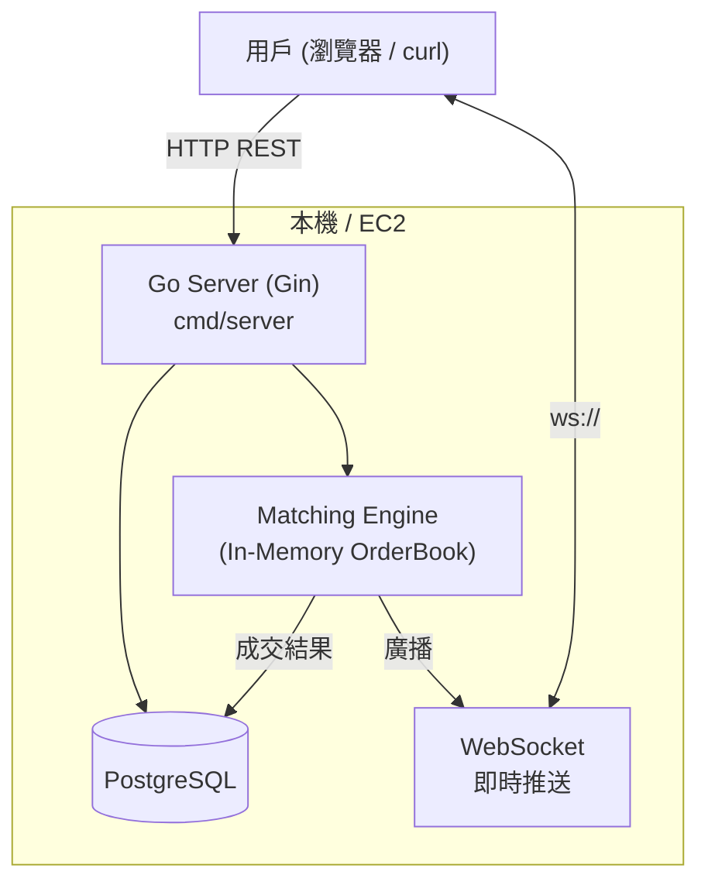
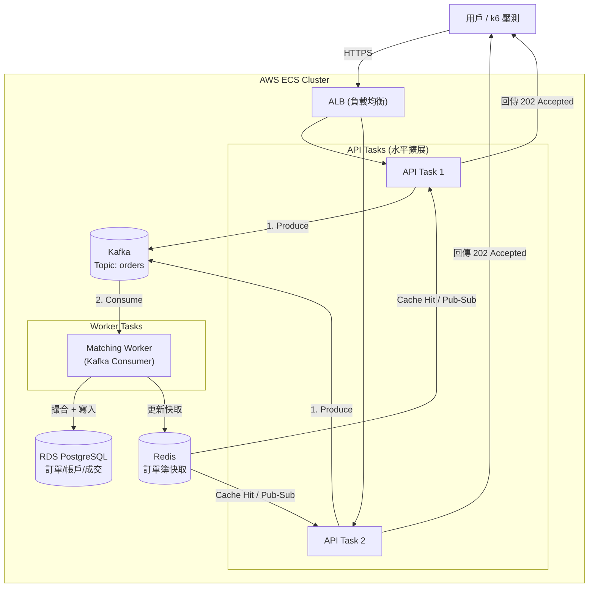
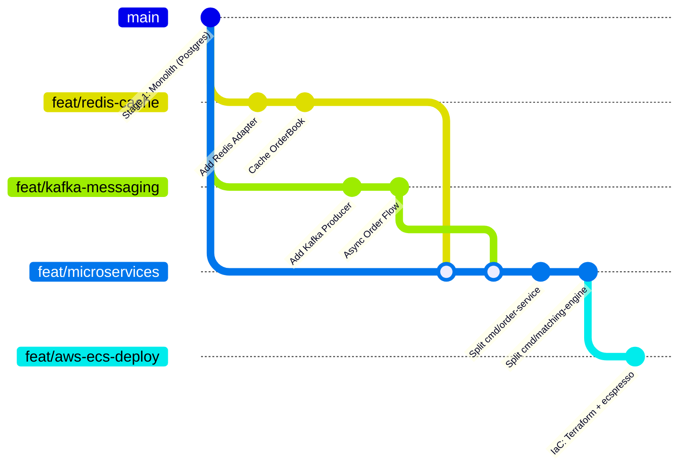
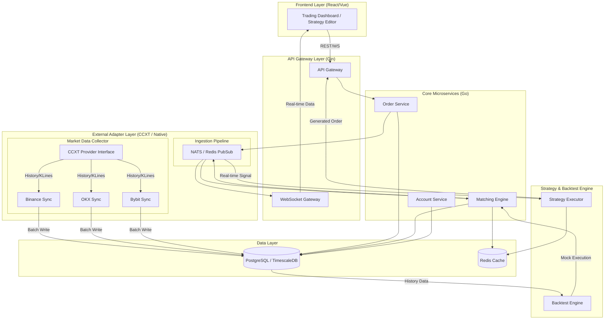

# 專案架構文件 (Architecture Document)

> **本文件為架構的唯一真相來源。** 記錄從當前單體架構到最終 CCXT 多交易所平台的完整演進路徑。

---

## 0. 專案目標與演進路線

```
現在                        近期目標                    長期目標
─────────────────────────────────────────────────────────────────────
單體 Go Server          → Redis + Kafka 非同步     → CCXT 多交易所
+ PostgreSQL            → ECS 微服務壓力測試       → 策略回測平台
(本地穩定運行)          → 學習 AWS 各項功能         → TimescaleDB + NATS
```

### 三大階段說明

| 階段 | 狀態 | 核心目標 |
|------|------|----------|
| **Stage 1：現行單體** | ✅ 完成 | 撮合引擎 MVP，本地可用 |
| **Stage 2：非同步微服務 + ECS** | 🔄 進行中 | 加 Redis/Kafka，拆微服務，上 ECS 壓測，學 AWS |
| **Stage 3：CCXT 多交易所平台** | 📋 規劃 | 接入真實行情，實作策略回測 |

---

## 1. 當前架構：單體 (Current State - Stage 1 ✅)



**現行技術棧：**
- **Web Framework**: Gin
- **撮合引擎**: 全記憶體 (In-Memory)，Price-Time Priority 演算法
- **資料庫**: PostgreSQL（訂單、帳戶、成交記錄）
- **即時推送**: WebSocket (gorilla/websocket)
- **日誌**: Uber Zap (結構化)
- **基礎設施 (IaC)**: Terraform (基礎設施) + ecspresso (ECS 部署)

**目錄結構（現行）：**
```
backend/
├── cmd/server/           # 單體 API 服務進入點
├── cmd/simulator/        # 壓測行情模擬器
├── internal/
│   ├── api/              # HTTP/WS Handler (Gin)
│   ├── core/             # 領域邏輯：service.go, domain.go, ports.go
│   ├── core/matching/    # 撮合引擎核心：engine.go, orderbook.go
│   ├── repository/       # PostgreSQL 存取層
│   ├── simulator/        # 模擬下單 Service
│   └── infrastructure/logger/
├── sql/                  # schema.sql, seed.sql
├── infra/
│   ├── terraform/        # 基礎設施 (VPC, RDS, ALB, ECS Cluster)
│   └── ecspresso/        # ECS 服務定義與版本管理 (Task Definition, Service)
└── test-api-v1.sh        # API 自動化測試腳本
```

---

## 2. 核心設計模式：六角架構 (Ports & Adapters)

核心邏輯 (`internal/core/`) 完全不認識 PostgreSQL、Redis 或任何外部框架。  
它只依賴自己定義的介面 (Ports)，外部實作插入進來 (Adapters)。

```
┌────────────────────────────────────────────────────────┐
│         Presentation Layer  (internal/api/)            │
│   Gin Handlers • WebSocket • Request/Response 轉換     │
└──────────────────────┬─────────────────────────────────┘
                       │ 呼叫 ExchangeService 介面
                       ▼
┌────────────────────────────────────────────────────────┐
│         Application Layer  (internal/core/)            │
│   domain.go • service.go • ports.go (interfaces)       │
│   Matching Engine (OrderBook, In-Memory)               │
└──────────────────────┬─────────────────────────────────┘
                       │ 透過 Interface 解耦（依賴反轉）
                       ▼
┌────────────────────────────────────────────────────────┐
│   Infrastructure Layer  (repository/ + infrastructure/)│
│   postgres.go → (未來) redis.go • kafka.go • ccxt.go   │
└────────────────────────────────────────────────────────┘
```

**好處**：要把 PostgreSQL 換成 TimescaleDB，或把 REST 換成 gRPC，只換 Adapter，核心邏輯完全不動。

---

## 3. 目標架構：非同步微服務 + ECS (Stage 2 🔄)

**目的**：加入 Redis 快取 + Kafka 削峰，再拆微服務部署到 AWS ECS 做壓力測試，學習 AWS 各項功能。

### 3.1 加入 Redis + Kafka 後的非同步架構



### 3.2 Redis 的用途

| 用途 | Key Pattern | TTL |
|------|-------------|-----|
| 訂單簿快取 | `orderbook:{symbol}` | 500ms |
| K 線快取 | `kline:{symbol}:{interval}` | 1m |
| Session / Rate Limit | `ratelimit:{user_id}` | 1s |

### 3.3 Kafka 的用途（削峰填谷）

```
同步（現在）：  HTTP → 鎖資金(DB) → 撮合 → 更新(DB) → 回傳  ← 高延遲
非同步（目標）：HTTP → Produce 到 Kafka → 回傳 202        ← < 5ms
                     Worker 從 Kafka 消費 → 撮合 → DB 更新
```

**Topic 設計：**
- `orders.new`：新訂單（API → Worker）
- `orders.result`：成交結果（Worker → API / WS）
- `market.kline`：K 線更新事件

### 3.4 微服務拆分

| 服務 | `cmd/` 入口 | 職責 |
|------|------------|------|
| **API Gateway** | `cmd/gateway` | 驗證/限流/路由（規劃中） |
| **Order Service** | `cmd/order-service` | 下單/撤單/訂單生命週期 |
| **Matching Engine** | `cmd/matching-engine` | 純記憶體撮合，單實例 |
| **Monolith** | `cmd/server` | 開發用整合服務（向後保留） |

### 3.5 ECS 壓測目標

| 指標 | 目標 |
|------|------|
| TPS（每秒下單數） | > 1000 TPS |
| P99 延遲 | < 50ms |
| 服務可用性 | > 99.9% |
| 壓測工具 | k6 |

**要學習的 AWS 服務：**
- **ECS Fargate**：無伺服器容器，Auto Scaling
- **ALB**：路徑路由、Health Check
- **RDS**：託管 PostgreSQL，快照備份
- **ElastiCache**：託管 Redis
- **CloudWatch**：Metrics、Logs、Alarm
- **ECR**：Docker Image 倉庫
- **SSM Parameter Store / Secrets Manager**：密鑰管理

### 3.6 IaC 部署策略 (Terraform + ecspresso)

為了讓學習路徑更貼近生產環境，我們採用 **「基礎架設」** 與 **「應用部署」** 分離的策略：

1.  **Terraform (基礎設施層)**: 
    - 管理 VPC, Subnets, Security Groups。
    - 管理 RDS 實例、ElastiCache 叢集、ALB、ECR 倉庫。
    - 管理 ECS Cluster (不管理具體的 Service/Task，由 ecspresso 接手)。
2.  **ecspresso (應用部署層)**:
    - 專注於 ECS Service 與 Task Definition 的版本管理。
    - 支援 `diff`, `wait`, `deploy` 等功能，比單純用 Terraform 管理 ECS Task 更靈活。
    - 方便在 CI/CD 中進行多版本滾動更新。

---

## 4. 雙模態交易環境（Dual-Mode Trading Environment）

> **核心理念**：保留自研撮合引擎（Stage 1），同時接入 CCXT 真實行情（Stage 3），兩條軌道**並行共存**，透過統一的 `mode` context 在前後端全鏈路切換。

### 4.1 為什麼需要雙模態？

傳統演進路線是「替換型」— Stage 3 完成後 Stage 1 退役。但我們選擇**保留型**設計：

| 考量 | 替換型（棄用 Stage 1） | 保留型（雙模態並行）✅ |
|------|----------------------|----------------------|
| 教學演示 | ❌ 失去本地可控環境 | ✅ 不依賴外部 API 即可完整展示 |
| 壓力測試 | ❌ 受交易所 API 限流影響 | ✅ 本地撮合無任何外部限制 |
| 離線開發 | ❌ 無網路無法運作 | ✅ 系統模擬完全離線可用 |
| 策略驗證 | 只能用真實行情 | ✅ 本地快速迭代 → 真實行情驗證 |
| 面試展示 | 依賴 API Key | ✅ 零配置即可 demo |

### 4.2 兩種模式定義

```
┌─────────────────────────────────────────────────────────────────────────┐
│                     INTERNAL（系統模擬）                                 │
│  ─────────────────────────────────────────────────────────────────────  │
│  資料來源：自研撮合引擎 + In-Memory OrderBook + PostgreSQL              │
│  行情驅動：cmd/simulator 模擬下單產生行情                               │
│  適用場景：教學、壓測、離線開發、面試 Demo                               │
│  特色：零外部依賴，完全可控                                             │
├─────────────────────────────────────────────────────────────────────────┤
│                     PAPER（市場模擬）                                    │
│  ─────────────────────────────────────────────────────────────────────  │
│  資料來源：CCXT 多交易所即時行情 + 歷史 K 線 (TimescaleDB)              │
│  行情驅動：Binance / OKX / Bybit WebSocket 即時推送                     │
│  適用場景：策略回測驗證、真實行情體驗、Paper Trading                     │
│  特色：貼近實盤但不動真金白銀                                           │
└─────────────────────────────────────────────────────────────────────────┘
```

### 4.3 後端架構設計

#### 4.3.1 模式路由層

前端透過 HTTP Header 或 Query Param 傳遞 `X-Trading-Mode: INTERNAL | PAPER`，後端 middleware 解析後注入 `context`：

```go
// internal/middleware/trading_mode.go
func TradingModeMiddleware() gin.HandlerFunc {
    return func(c *gin.Context) {
        mode := c.GetHeader("X-Trading-Mode")
        if mode == "" {
            mode = "INTERNAL" // 預設系統模擬
        }
        ctx := context.WithValue(c.Request.Context(), TradingModeKey, mode)
        c.Request = c.Request.WithContext(ctx)
        c.Next()
    }
}
```

#### 4.3.2 Data Source 抽象（Provider Pattern）

所有資料消費端不直接依賴具體實作，而是透過統一介面根據 `mode` 決定資料來源：

```go
// internal/core/ports.go — 統一資料供應介面
type MarketDataProvider interface {
    GetOrderBook(ctx context.Context, symbol string) (*OrderBook, error)
    GetKLines(ctx context.Context, symbol, interval string, limit int) ([]*KLine, error)
    SubscribeTicker(ctx context.Context, symbol string) (<-chan Ticker, error)
}

type OrderExecutor interface {
    PlaceOrder(ctx context.Context, req OrderRequest) (*Order, error)
    CancelOrder(ctx context.Context, orderID string) error
    GetOrders(ctx context.Context, userID string) ([]*Order, error)
}
```

```go
// internal/core/provider_router.go — 模式路由器
type ProviderRouter struct {
    internal MarketDataProvider  // 自研撮合引擎
    paper    MarketDataProvider  // CCXT 適配層
}

func (r *ProviderRouter) Resolve(ctx context.Context) MarketDataProvider {
    mode := ctx.Value(TradingModeKey).(string)
    if mode == "PAPER" {
        return r.paper
    }
    return r.internal
}
```

#### 4.3.3 模式差異矩陣

| API 端點 | INTERNAL 模式 | PAPER 模式 |
|----------|-------------|-----------|
| `GET /orderbook/:symbol` | 讀取 In-Memory OrderBook | CCXT `fetchOrderBook()` |
| `GET /klines/:symbol` | PostgreSQL `trades` 聚合 | TimescaleDB `market_data_klines` |
| `POST /orders` | 本地撮合引擎撮合 | CCXT Paper Trading（模擬成交） |
| `GET /portfolio` | 本地 `accounts` 表 | CCXT `fetchBalance()` + 本地追蹤 |
| `POST /backtests` | 用本地歷史成交數據 | 用 CCXT 歷史 K 線數據 |
| `WS /ws/trades` | 本地撮合事件推送 | CCXT WebSocket Ticker |

### 4.4 前端對應設計

前端透過 `TradingEnvironmentContext` 管理模式狀態，所有頁面共用同一套 UI 但根據模式呈現不同數據來源：

| 頁面 | INTERNAL（系統模擬） | PAPER（市場模擬） |
|------|---------------------|------------------|
| 交易看板 | 完整撮合介面 + 本地 OrderBook | CCXT 即時行情（佔位 UI → 後續接入） |
| 策略編輯 | 部署至系統模擬環境 | 部署至市場模擬環境 |
| 回測中心 | 使用本地歷史成交數據 | 使用 CCXT 歷史 K 線 |
| 資產風控 | 本地帳戶餘額 + 風控參數 | CCXT 帳戶資產 + 風控參數 |

**色調系統**：INTERNAL = 靛紫 (Purple)、PAPER = 青綠 (Emerald)，全站即時切換。

### 4.5 資料隔離策略

```
┌────────────────────────────────────────────────────────────────┐
│                      PostgreSQL                                │
│  ┌──────────────────────┐  ┌───────────────────────────────┐   │
│  │  INTERNAL Schema     │  │  PAPER Schema                 │   │
│  │  ──────────────────  │  │  ───────────────────────────  │   │
│  │  accounts (本地餘額)  │  │  paper_accounts (模擬餘額)    │   │
│  │  orders   (本地訂單)  │  │  paper_orders   (模擬訂單)    │   │
│  │  trades   (本地成交)  │  │  paper_trades   (模擬成交)    │   │
│  └──────────────────────┘  └───────────────────────────────┘   │
│                                                                │
│  ┌─────────────────────────────────────────────────────────┐   │
│  │  Shared Schema (共用)                                    │   │
│  │  strategies     (策略定義，兩種模式共用)                   │   │
│  │  backtest_results (回測結果，標記 mode 欄位區分)           │   │
│  │  risk_settings    (風控設定，各模式獨立)                   │   │
│  └─────────────────────────────────────────────────────────┘   │
└────────────────────────────────────────────────────────────────┘
```

### 4.6 實作優先級

| 優先級 | 項目 | 說明 |
|--------|------|------|
| P0 | 前端模式切換 UI | ✅ 已完成（Phase 2） |
| P0 | `TradingModeMiddleware` | 後端 middleware 解析模式 context |
| P1 | `ProviderRouter` | Data Source 路由器 |
| P1 | CCXT Adapter 實作 | `MarketDataProvider` 的 CCXT 實作 |
| P2 | Paper Account 隔離 | 模擬帳戶與本地帳戶分離 |
| P2 | 回測引擎模式分流 | 根據模式選擇不同歷史數據來源 |

---

## 5. 開發與部署策略：功能驅動 (Feature-Driven)

為確保微服務轉型過程中每個組件（Redis, Kafka, 微服務拆分）皆可獨立驗證，我們採用「功能驅動開發」與「階梯式部屬」策略。

### 5.1 分支進化路線圖（Stage 2）



### 5.2 階段性測試目標

| 階段分支 | 核心組件 | 獨立測試行為 |
| :--- | :--- | :--- |
| `feat/redis-cache` | Redis | 驗證 `GET /orderbook` 延遲從 20ms 降至 2ms；驗證 Redis 斷線時能 fallback 至 DB。 |
| `feat/kafka-messaging` | Kafka | 驗證 `POST /orders` 異步處理；即使 DB 延遲或掛掉，API 仍能穩定回傳 `202 Accepted`。 |
| `feat/microservices` | gRPC/Internal API | 驗證 `Order Service` 與 `Matching Engine` 進程間通訊正常；維持原本單體架構的 API 契約不變。 |
| `feat/aws-ecs-deploy` | ECS Fargate | 雲端壓力測試：模擬 1000+ TPS 觀察各服務負載平衡與 Auto-scaling 行為。 |

---

## 6. 最終目標：CCXT 多交易所平台 (Stage 3 📋)

**目的**：壓測完成、學完 AWS 後，**保留撮合引擎作為 INTERNAL 模式**，同時接入 CCXT 真實行情作為 PAPER 模式，實現雙軌並行的多交易所策略回測平台。

> 💡 Stage 3 **不是取代** Stage 1，而是在既有撮合引擎旁邊新增 CCXT 軌道。前端透過模式切換即可在兩者間無縫切換。詳見 [第 4 章：雙模態交易環境](#4-雙模態交易環境dual-mode-trading-environment)。

### 6.1 全系統架構圖（最終態 — 雙軌並行）



**關鍵設計（PAPER 模式的數據適配層）：**

```go
// internal/exchange/provider.go
type ExchangeProvider interface {
    FetchKLines(ctx context.Context, symbol string, interval string, since time.Time) ([]KLine, error)
    SubscribeTicker(ctx context.Context, symbol string) (<-chan Ticker, error)
}
```

不管底層對接的是 Binance 或 OKX，上層策略引擎只看 `KLine` 與 `Ticker` 的統一介面。

**技術選型：**

| 組件 | 技術 | 理由 |
|------|------|------|
| 時序資料庫 | TimescaleDB | PostgreSQL 擴展，K 線查詢快 10x |
| 訊息中間件 | NATS JetStream | 極低延遲，適合內部行情傳遞 |
| 回測數據校驗 | Gap Detection | 自動補齊斷線期間的缺失 K 線 |
| 效能分析 | Sharpe Ratio / MDD | 回測報表必備指標 |

---

## 7. 文件索引
