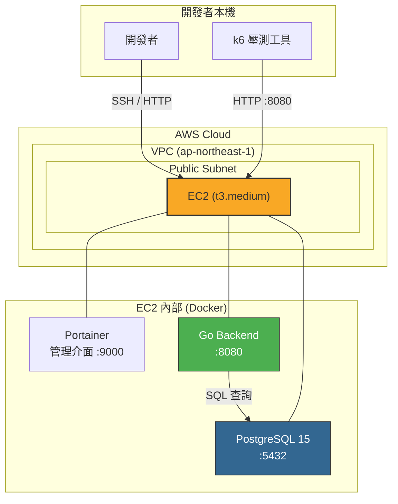
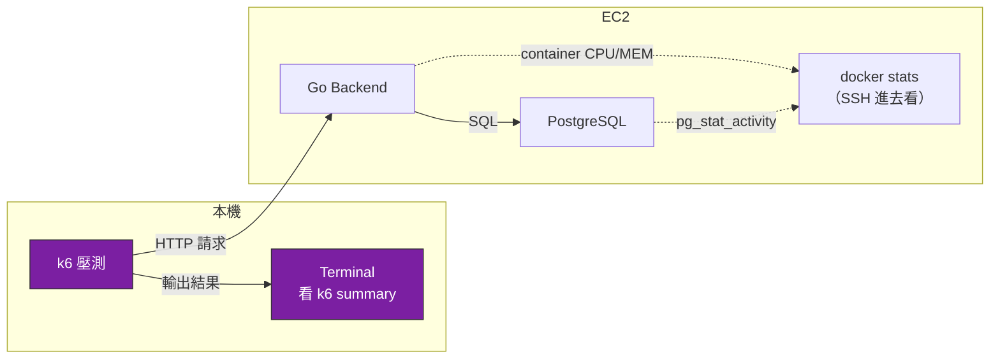
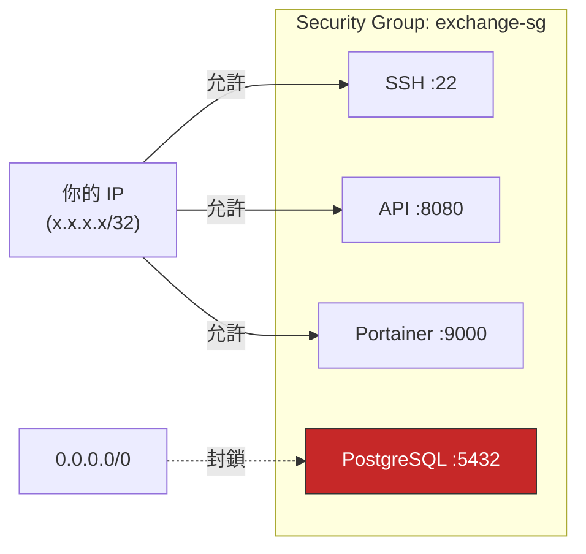

# Phase 1~2：單體部署與壓測架構

> 本文件涵蓋從本地 Docker → EC2 單機部署 → 第一次壓測的**架構設計與技術選型分析**。
> 操作步驟請參考 [ECS_LOADTEST_GUIDE.md](ECS_LOADTEST_GUIDE.md) 的 Phase 0~2。

---

## 1. Phase 1 架構圖：單體上 EC2



### 架構特點

- **全部在同一台 EC2** 上用 Docker Container 跑
- 用 **Portainer** 管理 Container（省去 SSH + docker 命令）
- 用 **Security Group** 只開放自己的 IP
- 最簡單的架構，目的是**先讓程式上雲跑得通**

---

## 2. 技術選型分析

### 2.1 運算資源：EC2 vs Fargate vs Lambda

> Phase 1 先用 EC2，Phase 4 再遷移到 ECS Fargate。

| 維度                 | EC2                 | ECS Fargate             | Lambda         |
| -------------------- | ------------------- | ----------------------- | -------------- |
| **控制權**           | 完全控制 OS         | 只管 Container          | 只管函式       |
| **SSH 進去 debug**   | ✅ 可以             | ❌ 不行                 | ❌ 不行        |
| **適合學習階段**     | ✅ Phase 1~3        | ✅ Phase 4+             | ❌ 不適合      |
| **WebSocket 支援**   | ✅                  | ✅                      | ❌ 15 分鐘限制 |
| **費用（最小規格）** | ~$35/月 (t3.medium) | ~$30/月 (0.5vCPU/1GB)   | 按調用次數     |
| **自管 DB/Redis**    | ✅ 同機跑 Docker    | ❌ 要用 RDS/ElastiCache | ❌             |
| **啟動速度**         | 分鐘級              | 秒級                    | 毫秒級         |

**Phase 1 選 EC2 的理由：**

1. 可以 SSH 進去 debug，學習初期排錯效率最高
2. DB、Redis、Kafka 都能用 Docker 跑在同一台，**省錢**
3. 用 Portainer 當 GUI 管理 Container，降低學習曲線

**Phase 4 換 Fargate 的理由：**

1. 水平擴展時，不想管 EC2 實例的生命週期
2. 按用量計費，壓測完不跑就不收錢
3. ECS Service 自帶 Auto Scaling

---

### 2.2 資料庫：EC2 Docker vs RDS

| 維度         | EC2 自管 PostgreSQL    | RDS PostgreSQL            |
| ------------ | ---------------------- | ------------------------- |
| **費用**     | $0（包在 EC2 內）      | ~$30/月 (db.t3.micro)     |
| **備份**     | 手動 `pg_dump`         | 自動 Snapshot             |
| **高可用**   | 無                     | Multi-AZ（額外費用）      |
| **效能調整** | 改 Docker 啟動參數     | Console 改參數群組        |
| **連線池**   | 自管（Go pgxpool）     | 可加 RDS Proxy            |
| **適合場景** | Phase 1~3（學習/省錢） | Phase 4+（需要穩定/擴展） |

**結論：Phase 1~3 用 EC2 自管，Phase 4 水平擴展時考慮遷移 RDS。**

判斷遷移時機：

- EC2 的 CPU 被 PostgreSQL 搶走 → 該分離了
- 需要自動備份/災難復原 → 用 RDS
- 需要 Read Replica（讀寫分離）→ 用 RDS

---

## 3. Phase 2 架構圖：壓測觀測



---

## 4. 壓測結果觀測方式比較

> Phase 2 先用最簡單的方式，Phase 6 才引入 Prometheus + Grafana。

### 4.1 觀測方式比較

| 方式                     | 設定複雜度      | 資訊豐富度               | 費用         | 適合階段            |
| ------------------------ | --------------- | ------------------------ | ------------ | ------------------- |
| **k6 Terminal 輸出**     | ⭐ 零設定       | P95/P99/錯誤率/TPS       | 免費         | ✅ Phase 2~5        |
| **docker stats（SSH）**  | ⭐ 零設定       | CPU/記憶體/網路 IO       | 免費         | ✅ Phase 2~3        |
| **pg_stat_activity**     | ⭐ 零設定       | DB 連線數/狀態           | 免費         | ✅ Phase 2~5        |
| **CloudWatch Basic**     | ⭐ 自動開       | EC2 CPU/網路（無記憶體） | 免費         | ✅ Phase 1+         |
| **CloudWatch Agent**     | ⭐⭐ 需安裝     | CPU + 記憶體 + 磁碟      | 計量收費     | Phase 4+            |
| **Prometheus + Grafana** | ⭐⭐⭐ 需部署   | 自訂指標/儀表板          | 免費（自管） | Phase 6             |
| **AWS X-Ray**            | ⭐⭐⭐ 需埋 SDK | 分散式追蹤/火焰圖        | 計量收費     | Phase 7（微服務後） |

### 4.2 推薦的漸進式策略

```
Phase 2~3（單機）：
  k6 terminal + docker stats + pg_stat_activity
  → 夠用了，不要過度設定

Phase 4~5（多實例）：
  上面的 + CloudWatch Container Insights（ECS 自帶）
  → ECS 的 CloudWatch 不用額外設定就有基本指標

Phase 6（可觀測性）：
  上面的 + Prometheus + Grafana
  → 學習自建監控系統

Phase 7（微服務）：
  上面的 + X-Ray（分散式追蹤）
  → 跨服務呼叫要用追蹤才能找到瓶頸
```

### 4.3 k6 結果存檔與對比

```bash
# 每次壓測都存結果，方便對比
k6 run --out json=results/phase1_baseline.json ...
k6 run --out json=results/phase3_with_redis.json ...
k6 run --out json=results/phase4_ecs_2tasks.json ...

# 用 k6 自帶的 summary 對比就夠
# 不需要額外裝 InfluxDB/Grafana（那是 Phase 6 的事）
```

> [!TIP]
> **不要在 Phase 2 就急著裝 Prometheus + Grafana。** k6 的 terminal 輸出 + SSH 看 `docker stats` 完全夠用。過早引入監控會分散你的注意力，讓你花時間在「看漂亮的圖表」而不是「理解瓶頸」。

---

## 5. Phase 2 關鍵問題清單

### Q1：壓測應該從本機打還是從另一台 EC2 打？

| 方案                 | 優點             | 缺點               |
| -------------------- | ---------------- | ------------------ |
| **從本機打**（推薦） | 零成本、操作方便 | 受本機網路頻寬限制 |
| 從另一台 EC2 打      | 網路穩定、頻寬大 | 多花一台 EC2 的錢  |
| 用 k6 Cloud          | 全託管、可分散式 | 要付費             |

**結論：Phase 2 從本機打就夠了。** 如果 VU > 500 出現本機頻寬瓶頸，再考慮從 EC2 打。

### Q2：為什麼不一開始就上 ECS？

因為 ECS + Fargate 的 DB 必須用 **RDS**（Fargate 沒有本地磁碟），一上來就是 ~$60/月。而 EC2 自管全部只要 ~$35/月，且能 SSH debug。**先搞懂程式的瓶頸在哪，再決定架構怎麼演進。**

### Q3：EC2 規格怎麼選？

| 規格          | vCPU | 記憶體 | 月費 | 適合                  |
| ------------- | ---- | ------ | ---- | --------------------- |
| t3.small      | 2    | 2 GB   | ~$18 | 只跑 Go + PG，VU < 50 |
| **t3.medium** | 2    | 4 GB   | ~$35 | **推薦起點**，VU 100  |
| t3.large      | 2    | 8 GB   | ~$65 | 加 Redis + Kafka 後   |

> [!WARNING]
> **t3 系列有 CPU Credit 機制**。持續高 CPU 會把 Credit 用完後降速。壓測時如果發現 CPU 突然從 80% 掉到 20%，很可能是 Credit 用完了。可以改用 `t3.unlimited` 或 `m5.large`（無 Credit 限制）。

---

## 6. 安全性基本設定

### Security Group 規劃



| Port              | 來源              | 說明                        |
| ----------------- | ----------------- | --------------------------- |
| 22 (SSH)          | 你的 IP           | 管理用                      |
| 8080 (API)        | 你的 IP（壓測時） | 後端 API                    |
| 9000 (Portainer)  | 你的 IP           | 容器管理 GUI                |
| 5432 (PostgreSQL) | **不對外開放**    | 只允許 EC2 內部 Docker 網路 |
| 6379 (Redis)      | **不對外開放**    | Phase 3 才加，只限內部      |

> [!CAUTION]
> **絕對不要把 PostgreSQL 的 5432 port 對外開放。** 即使有密碼，暴露在公網上會不斷被掃描和暴力破解。
