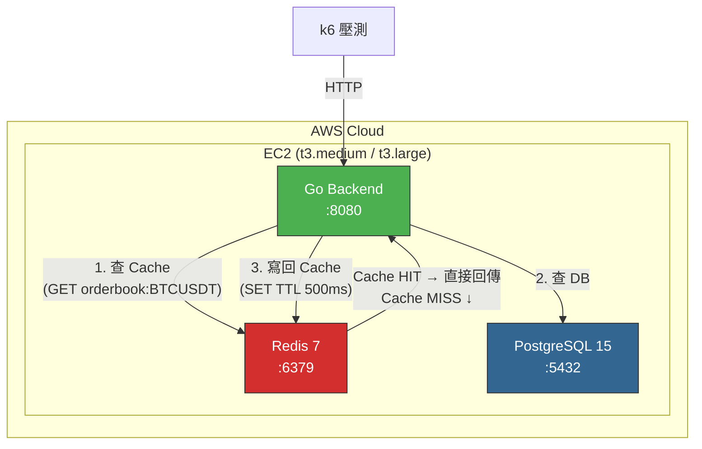
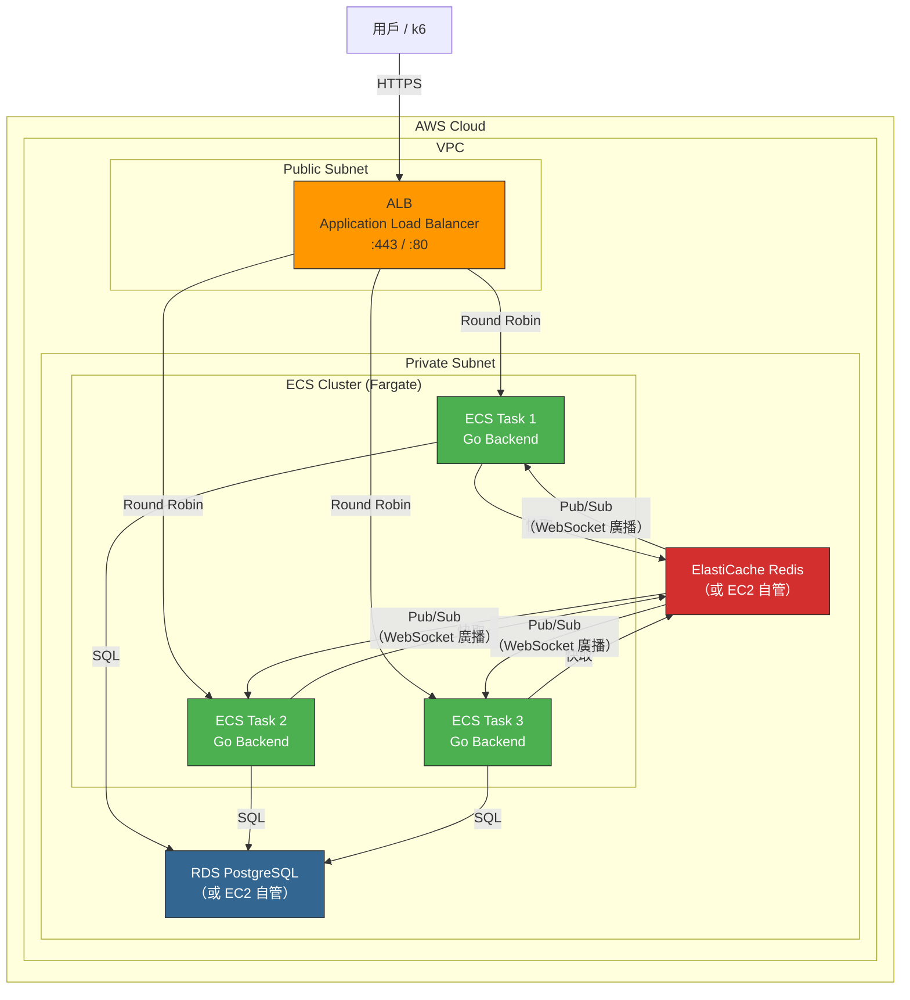
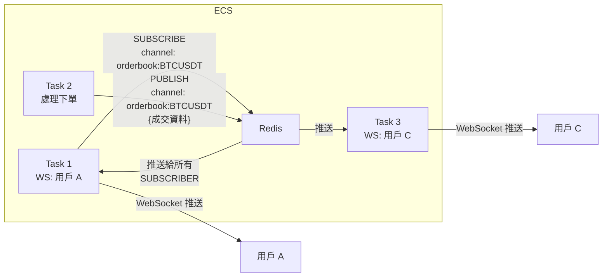

# Phase 3~4：Redis 快取 + 水平擴展架構

> 本文件涵蓋引入 Redis 解決讀取熱點，以及遷移到 ECS 水平擴展的**架構設計與技術選型分析**。
> 操作步驟請參考 [ECS_LOADTEST_GUIDE.md](ECS_LOADTEST_GUIDE.md) 的 Phase 3~4。

---

## 1. Phase 3 架構圖：引入 Redis



### 快取策略：Cache-Aside（Lazy Loading）

```
讀取流程：
  Client → 查 Redis → HIT → 直接回傳
                     → MISS → 查 DB → 寫回 Redis（TTL 500ms）→ 回傳

寫入流程：
  Client → 寫 DB → 刪除 Redis 對應的 key（Invalidation）
```

> [!IMPORTANT]
> **為什麼 TTL 設 500ms 而不是更久？** 訂單簿是高頻變動的資料，TTL 太長會造成用戶看到過期的報價。500ms 的意思是「最多落後 0.5 秒」，這在學習場景是可接受的。生產環境可能需要改用 Redis Pub/Sub 做即時推送。

---

## 2. Redis 部署選型

### 2.1 EC2 自管 Redis vs ElastiCache

| 維度             | EC2 Docker Redis     | ElastiCache Redis        |
| ---------------- | -------------------- | ------------------------ |
| **費用**         | $0（包在 EC2 內）    | ~$25/月 (cache.t3.micro) |
| **高可用**       | 單節點，掛了就沒     | Multi-AZ 自動 Failover   |
| **備份**         | 手動 RDB/AOF         | 自動 Snapshot            |
| **Cluster 模式** | 手動設定             | Console 一鍵開           |
| **維護**         | 自己管版本升級       | AWS 自動 Patching        |
| **網路延遲**     | 同機，~0.1ms         | 同 VPC，~0.5ms           |
| **適合場景**     | Phase 3（學習/省錢） | Phase 4+（需要穩定）     |

**遷移判斷條件：**

- EC2 記憶體被 Redis 搶走（`maxmemory` 設太大）→ 該分離了
- 需要 Redis Cluster（資料量 > 單機記憶體）→ 用 ElastiCache
- 水平擴展後，多個 ECS Task 都需要共享同一個 Redis → 必須用 ElastiCache 或獨立的 EC2 Redis

---

### 2.2 Redis vs Memcached

| 維度         | Redis                              | Memcached      |
| ------------ | ---------------------------------- | -------------- |
| **資料結構** | String, Hash, List, Set, SortedSet | 只有 Key-Value |
| **持久化**   | ✅ RDB/AOF                         | ❌ 重啟就沒    |
| **Pub/Sub**  | ✅                                 | ❌             |
| **Cluster**  | ✅ 原生支援                        | ✅             |
| **適合場景** | 快取 + Pub/Sub + Session           | 純快取         |

**結論：選 Redis。** 理由：

1. 後續 Phase 4 水平擴展時，需要 **Redis Pub/Sub** 做 WebSocket 跨實例廣播
2. 可以用 Sorted Set 存訂單簿，比純 JSON 快取更靈活
3. 生態系更好，Go 的 `go-redis` 庫功能更完整

---

## 3. Phase 4 架構圖：水平擴展



---

## 4. ELB 選型：ALB vs NLB

> Phase 4 選 ALB，不是 NLB。

| 維度               | ALB (Application)      | NLB (Network)   |
| ------------------ | ---------------------- | --------------- |
| **協定**           | HTTP/HTTPS/WebSocket   | TCP/UDP/TLS     |
| **路由功能**       | ✅ 路徑路由、Host 路由 | ❌ 只看 IP:Port |
| **WebSocket**      | ✅ 原生支援            | ✅ 透通（TCP）  |
| **Sticky Session** | ✅ Cookie-based        | ✅ IP-based     |
| **Health Check**   | HTTP 路徑（`/health`） | TCP 連線        |
| **延遲**           | ~1ms                   | ~0.1ms          |
| **費用**           | ~$20/月 + LCU          | ~$20/月 + NLCU  |
| **TLS 終止**       | ✅ ALB 做              | ✅ NLB 做       |
| **適合場景**       | Web API + WebSocket    | 極低延遲、gRPC  |

**選 ALB 的理由：**

1. **HTTP 路徑路由**：未來微服務拆分時，可以用 `/api/v1/orders` → Order Service、`/api/v1/orderbook` → Market Data Service
2. **WebSocket 支援**：交易所需要即時推送
3. **Health Check**：用 HTTP `GET /health` 更精準（NLB 只檢查 TCP 連線是否通）
4. **Sticky Session**：撮合引擎在記憶體中，同一用戶需要打同一台

> [!NOTE]
> **什麼時候該選 NLB？** 如果你的服務是純 gRPC（Phase 7 服務間通訊），或需要極低延遲（< 1ms），或需要靜態 IP，才考慮 NLB。你的外部 API 用 ALB 就對了。

---

## 5. ECS 啟動類型：EC2 vs Fargate

| 維度                             | ECS on EC2                        | ECS on Fargate            |
| -------------------------------- | --------------------------------- | ------------------------- |
| **管理範圍**                     | 要管 EC2 實例 + Container         | 只管 Container            |
| **Scaling**                      | 兩層：EC2 Auto Scaling + ECS Task | 一層：ECS Task 直接 Scale |
| **費用（2 Task, 0.5vCPU each）** | ~$35/月（t3.medium 共用）         | ~$30/月                   |
| **費用（10 Task）**              | 需要更多 EC2                      | ~$150/月                  |
| **啟動速度**                     | 30~60 秒                          | 10~30 秒                  |
| **SSH Debug**                    | ✅ 可以                           | ❌ 不行（用 ECS Exec）    |
| **GPU 支援**                     | ✅                                | ❌                        |
| **本地磁碟**                     | ✅ 有 EBS                         | ❌ 只有暫時性 20GB        |
| **適合場景**                     | 需要 GPU、大量持久儲存            | **一般 Web 服務（推薦）** |

**Phase 4 選 Fargate 的理由：**

1. 不用管 EC2 生命週期，專注在應用
2. 按秒計費，壓測完 Scale 到 0 就不收費
3. Auto Scaling 只有一層，設定簡單

---

## 6. WebSocket 跨實例問題

### 問題描述

```
用戶 A 透過 ALB 連到 Task 1 的 WebSocket
用戶 B 下單 → ALB 路由到 Task 2 處理
Task 2 成交了，要通知用戶 A → 但用戶 A 的 WebSocket 在 Task 1 上！
```

### 解法比較

| 方案                       | 實作難度      | 延遲       | 適合階段                  |
| -------------------------- | ------------- | ---------- | ------------------------- |
| **ALB Sticky Session**     | ⭐ 最簡單     | 無額外延遲 | Phase 4 學習用            |
| **Redis Pub/Sub 廣播**     | ⭐⭐ 中等     | +1~2ms     | Phase 4+（推薦）          |
| **Kafka 事件驅動**         | ⭐⭐⭐ 較複雜 | +5~10ms    | Phase 5+（有 Kafka 才用） |
| **AWS IoT Core / AppSync** | ⭐⭐ 中等     | +3~5ms     | 託管方案，不推薦學習      |

### Redis Pub/Sub 架構（推薦）



**實作要點：**

1. 每個 ECS Task 啟動時 `SUBSCRIBE` 相關 channel
2. 收到下單成交時 `PUBLISH` 到 channel
3. 所有 Task 收到後，推送給自己身上的 WebSocket 連線

---

## 7. Phase 4 Auto Scaling 策略

### ECS Service Auto Scaling 設定

```
觸發條件：
  CPU 平均使用率 > 70% → Scale Out（加 Task）
  CPU 平均使用率 < 30% → Scale In（減 Task）

限制：
  最小 Task 數：2（高可用最低要求）
  最大 Task 數：10（控制費用）

冷卻時間：
  Scale Out Cooldown：60 秒（快速反應）
  Scale In Cooldown：300 秒（避免頻繁縮減）
```

### 為什麼不用請求數做 Scaling 指標？

| Scaling 指標                  | 優點         | 缺點                    |
| ----------------------------- | ------------ | ----------------------- |
| **CPU 使用率**（推薦）        | 直接反映負載 | 對 I/O 密集型不準       |
| 請求數 (RequestCount)         | 預測流量峰值 | 不反映每個請求的成本    |
| 回應時間 (TargetResponseTime) | 反映用戶體驗 | 延遲高可能是 DB 不是 Go |
| 自訂指標（Kafka Lag）         | 精準         | 設定複雜                |

**Phase 4 用 CPU 就夠了。** 進到 Phase 5 有 Kafka 後，可以考慮用 Consumer Lag 做更精準的 Scaling。

---

## 8. DB 遷移到 RDS 的判斷

### 何時該從 EC2 自管遷移到 RDS？

```
繼續自管 ←──────────────────────────────────── 遷移 RDS
    │                                              │
    ├ EC2 上只跑 Go + PG，資源還夠                   ├ 水平擴展後，Task 數 > 2
    ├ 不需要自動備份                                 ├ 需要自動備份/災難復原
    ├ 單機開發/學習                                  ├ EC2 上 PG CPU 搶走 Go 的資源
    └ 省錢優先                                      └ 需要 Read Replica（讀寫分離）
```

### RDS 規格建議

| 規格            | vCPU | 記憶體 | 月費  | 適合         |
| --------------- | ---- | ------ | ----- | ------------ |
| db.t3.micro     | 2    | 1 GB   | ~$15  | 測試/學習    |
| **db.t3.small** | 2    | 2 GB   | ~$30  | **壓測推薦** |
| db.t3.medium    | 2    | 4 GB   | ~$60  | 高併發       |
| db.r5.large     | 2    | 16 GB  | ~$120 | 生產環境     |

> [!WARNING]
> **RDS 最大的隱藏成本是 Storage IOPS。** db.t3 系列有 IOPS burst，跟 EC2 的 CPU Credit 一樣會用完。如果壓測時 DB 突然變慢，可能是 IOPS Credit 耗盡。用 `gp3` 存儲類型可以獨立設定 IOPS。

---

## 9. Phase 3→4 演進費用對比

| 架構                | 組成                                    | 月費估算 |
| ------------------- | --------------------------------------- | -------- |
| Phase 3（EC2 全包） | t3.medium + Docker(Go+PG+Redis)         | ~$35     |
| Phase 4a（最省）    | Fargate x2 + EC2(PG+Redis)              | ~$60     |
| Phase 4b（建議）    | Fargate x2 + RDS(t3.small) + EC2(Redis) | ~$90     |
| Phase 4c（全託管）  | Fargate x2 + RDS + ElastiCache          | ~$115    |

**建議路徑：Phase 3 → Phase 4a → 壓測確認需要後再升 4b → 4c。**
