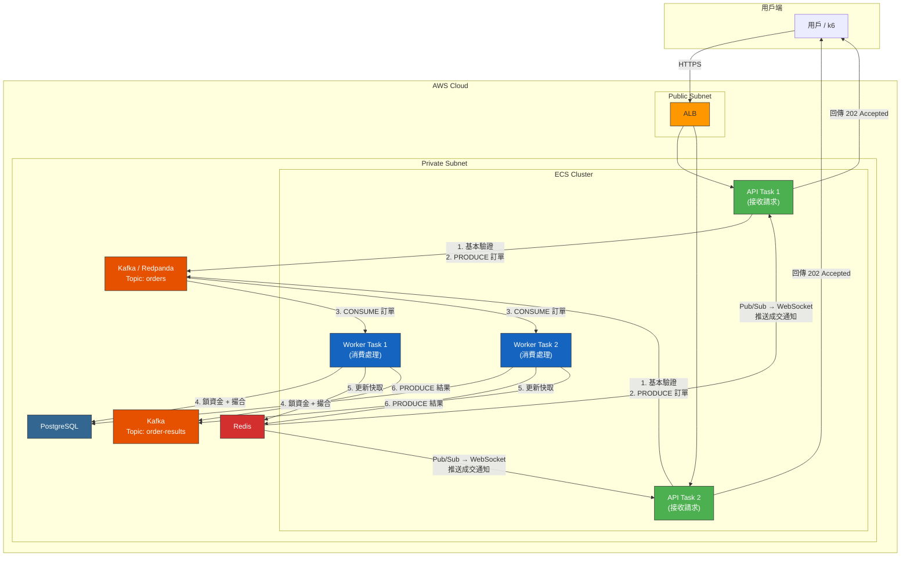
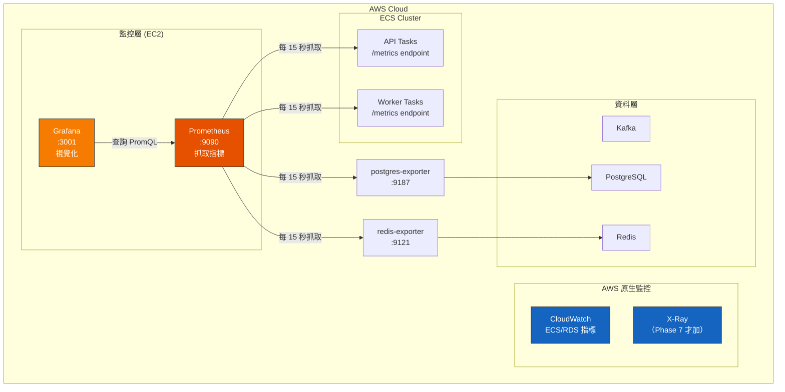

# Phase 5~6：Kafka 非同步削峰 + 可觀測性架構

> 本文件涵蓋引入 Message Queue 非同步處理與建立監控體系的**架構設計與技術選型分析**。
> 操作步驟請參考 [ECS_LOADTEST_GUIDE.md](ECS_LOADTEST_GUIDE.md) 的 Phase 5~6。

---

## 1. Phase 5 架構圖：非同步削峰



### 架構變化重點

```
同步架構（Phase 4）：
  HTTP 進來 → 鎖資金(DB) → 撮合 → 更新(DB) → 回傳 200
  用戶等整條鏈完成，高併發下 timeout

非同步架構（Phase 5）：
  HTTP 進來 → 基本驗證 → PRODUCE 到 Kafka → 回傳 202 Accepted（< 5ms）
  Worker 背景處理 → 結果透過 WebSocket 推送

  關鍵改變：HTTP 請求的生命週期被縮短到微秒級
```

---

## 2. MQ 技術選型：Kafka vs SQS vs Redpanda

> 這是最常被問到的選型問題。結論：**學習用 Redpanda（Kafka 相容），生產考慮 MSK 或 SQS。**

### 2.1 三方對比

| 維度                  | Kafka (MSK)               | SQS                            | Redpanda          |
| --------------------- | ------------------------- | ------------------------------ | ----------------- |
| **協定**              | Kafka Protocol            | AWS API (HTTP)                 | Kafka Protocol    |
| **管理方式**          | MSK 託管                  | 完全託管                       | 自管 Container    |
| **訊息順序**          | ✅ Partition 內保證       | ❌ 標準版不保證（FIFO 版保證） | ✅ 同 Kafka       |
| **Consumer Group**    | ✅ 原生支援               | ❌ 沒有（用 Lambda 觸發）      | ✅ 同 Kafka       |
| **訊息回放 (Replay)** | ✅ 可重新消費歷史         | ❌ 消費後刪除                  | ✅ 同 Kafka       |
| **吞吐量**            | 百萬級/秒                 | 約 3000 msg/s（標準版）        | 百萬級/秒         |
| **延遲**              | ~5ms                      | ~20-50ms                       | ~2ms              |
| **費用（學習量）**    | ~$80/月 (MSK t3.small x2) | ~$0（免費額度夠）              | $0（Docker 跑）   |
| **費用（生產量）**    | ~$200+/月                 | 依量計費                       | 自管 EC2 費用     |
| **學習價值**          | ⭐⭐⭐ 業界主流           | ⭐ AWS 特定                    | ⭐⭐⭐ Kafka 相容 |
| **運維複雜度**        | ⭐⭐ MSK 託管             | ⭐ 零運維                      | ⭐⭐ 自管         |

### 2.2 選型決策流程

```
你的需求是什麼？
    │
    ├── 只是想解耦，不需要訊息順序
    │   └── → SQS（最簡單、最便宜、零運維）
    │
    ├── 需要訊息順序 + Consumer Group + 學習 Kafka 生態
    │   │
    │   ├── Phase 5 學習階段
    │   │   └── → Redpanda（Docker 一行跑起來，100% Kafka API 相容）
    │   │
    │   └── Phase 7 生產/面試展示
    │       └── → MSK（AWS 託管 Kafka，面試講 MSK 更有說服力）
    │
    └── 需要訊息回放（重跑歷史訂單）
        └── → Kafka / Redpanda（SQS 做不到）
```

### 2.3 為什麼交易所場景不推薦 SQS？

| 場景              | SQS 問題               | Kafka 優勢                         |
| ----------------- | ---------------------- | ---------------------------------- |
| **訂單順序**      | 標準 SQS 不保證順序    | Partition Key = UserID，同用戶有序 |
| **撮合回放**      | 消費後刪除，無法重跑   | 可重設 Offset 重跑歷史             |
| **Consumer 並行** | 多 Consumer 搶同一訊息 | Consumer Group 自動分配 Partition  |
| **監控**          | 沒有 Consumer Lag 概念 | Consumer Lag 是關鍵監控指標        |

> [!NOTE]
> **SQS 不是不好，是不適合這個場景。** 如果你的需求是「下單後寄 email 通知」，SQS + Lambda 秒殺 Kafka。工具沒有好壞，只有適不適合。

### 2.4 Redpanda vs Kafka 差異

| 維度            | Apache Kafka                             | Redpanda            |
| --------------- | ---------------------------------------- | ------------------- |
| **語言**        | Java (JVM)                               | C++                 |
| **依賴**        | 需要 ZooKeeper（舊版）                   | 不需要任何外部依賴  |
| **記憶體**      | 建議 6GB+                                | 512MB 就能跑        |
| **Docker 部署** | 至少 2 個 Container（Kafka + ZooKeeper） | 1 個 Container      |
| **API 相容性**  | 原版                                     | 100% Kafka API 相容 |
| **適合場景**    | 生產環境                                 | 開發/測試/學習      |

**結論：Phase 5 用 Redpanda 學（省資源），Phase 7 面試展示用 MSK（更專業）。**

---

## 3. Phase 5 關鍵設計問題

### 3.1 冪等性（Idempotency）

Kafka 保證 **at-least-once delivery**，代表同一筆訂單可能被 Worker 處理兩次（Worker 處理完但 Commit Offset 前掛掉）。

```
解法：每筆訂單帶唯一 order_id
  Worker 處理前先查 DB：
    SELECT id FROM orders WHERE id = $order_id
    → 已存在 → SKIP（冪等）
    → 不存在 → 正常處理
```

### 3.2 如何處理 Consumer Lag 過高？

```
觀察到 Consumer Lag 持續上升
    │
    ├── Worker 處理速度太慢
    │   ├── DB 查詢太慢 → 加索引 / 加 Redis 快取
    │   └── 運算密集 → 加更多 Worker Task
    │
    ├── Producer 速度暴增
    │   └── → 增加 Partition 數 + 對應增加 Worker 數
    │
    └── Worker 卡住（Deadlock / Error Loop）
        └── → 檢查 Worker 日誌
```

### 3.3 Partition 數量怎麼決定？

| Partition 數 | Worker 數上限 | 適合場景                  |
| ------------ | ------------- | ------------------------- |
| 1            | 1             | 嚴格全局順序（撮合引擎）  |
| 3            | 3             | **學習/壓測（推薦起點）** |
| 12           | 12            | 生產環境                  |
| 50+          | 50+           | 超高吞吐量                |

> **經驗法則**：Partition 數 = 預期 Consumer 數的 2~3 倍，留有擴展空間。

---

## 4. Phase 6 架構圖：可觀測性



---

## 5. 監控技術選型

### 5.1 CloudWatch vs Prometheus+Grafana vs X-Ray

| 維度          | CloudWatch                    | Prometheus + Grafana        | X-Ray              |
| ------------- | ----------------------------- | --------------------------- | ------------------ |
| **用途**      | 基礎設施指標                  | 應用指標 + 自訂 Dashboard   | 分散式追蹤         |
| **設定難度**  | ⭐ ECS 自動整合               | ⭐⭐⭐ 需部署 + 設定        | ⭐⭐ 需埋 SDK      |
| **費用**      | 基本免費，Custom Metrics 收費 | 免費（自管）                | 計量收費           |
| **自訂指標**  | ✅ PutMetricData API          | ✅ Prometheus client_golang | ❌（不是做這個的） |
| **Dashboard** | ⚠️ 功能陽春                   | ✅ 強大、可分享             | ❌ 只有追蹤圖      |
| **告警**      | ✅ CloudWatch Alarms          | ✅ Alertmanager             | ❌                 |
| **歷史保留**  | 15 個月                       | 依磁碟（常設 30 天）        | 30 天              |
| **學習價值**  | ⭐ AWS 特定                   | ⭐⭐⭐ 業界標準             | ⭐⭐ 微服務必備    |

### 5.2 三者的關係（互補，非互斥）

```
         CloudWatch              Prometheus + Grafana           X-Ray
         ──────────              ────────────────────           ─────
         基礎設施指標              應用層指標                    請求追蹤

         EC2 CPU                 order_duration_seconds         Request A 的完整路徑：
         ECS Task 數量            orderbook_depth_total          API → Redis → DB
         RDS 連線數               cache_hit_rate                  ↑ 哪一步最慢？
         ALB 延遲                 kafka_consumer_lag

         → Phase 4 自動有         → Phase 6 手動加               → Phase 7 微服務後加
```

### 5.3 推薦的漸進式監控策略

| 階段        | 工具                            | 看什麼                                       |
| ----------- | ------------------------------- | -------------------------------------------- |
| Phase 2~3   | k6 + `docker stats`             | 夠用，不要過度設定                           |
| Phase 4     | + CloudWatch Container Insights | ECS Task CPU / 記憶體 / 網路（自動有）       |
| **Phase 6** | **+ Prometheus + Grafana**      | 自訂指標 Dashboard（下單延遲、快取命中率等） |
| Phase 7     | + X-Ray                         | 跨服務請求追蹤，找出哪個服務最慢             |

---

## 6. Prometheus 指標設計指南

### 6.1 三種指標類型

| 類型          | 用途                    | 範例             | PromQL 查詢                      |
| ------------- | ----------------------- | ---------------- | -------------------------------- |
| **Counter**   | 只增不減的累計值        | 請求總數、錯誤數 | `rate(http_errors_total[5m])`    |
| **Gauge**     | 可增可減的即時值        | 連線數、佇列深度 | `exchange_orderbook_depth_total` |
| **Histogram** | 分布統計（P50/P95/P99） | 請求延遲         | `histogram_quantile(0.95, ...)`  |

### 6.2 交易所應埋的核心指標

```go
// 以下是 internal/infrastructure/metrics/metrics.go 的設計

// 1. 下單延遲分布（最重要）
exchange_order_duration_seconds{status="success|failed"}

// 2. 訂單簿深度（即時值）
exchange_orderbook_depth_total{symbol="BTCUSDT", side="buy|sell"}

// 3. HTTP 錯誤（按路徑 + 狀態碼）
exchange_http_errors_total{method="POST", path="/orders", status_code="500"}

// 4. Redis 快取命中率
exchange_cache_operations_total{result="hit|miss"}

// 5. Kafka Consumer Lag（Phase 5 加）
exchange_kafka_consumer_lag{topic="orders", partition="0"}

// 6. DB 連線池使用率
exchange_db_pool_active_connections
exchange_db_pool_idle_connections
```

### 6.3 Grafana Dashboard 佈局建議

```
Row 1: 整體概觀
  ┌─────────────┐  ┌─────────────┐  ┌─────────────┐  ┌─────────────┐
  │  下單 TPS    │  │  P95 延遲   │  │  錯誤率     │  │  CPU 使用率  │
  └─────────────┘  └─────────────┘  └─────────────┘  └─────────────┘

Row 2: 資料層
  ┌─────────────────────┐  ┌─────────────────────┐
  │  DB 連線數 + 慢查詢   │  │  Redis 命中率 + 記憶體 │
  └─────────────────────┘  └─────────────────────┘

Row 3: 佇列（Phase 5+）
  ┌─────────────────────┐  ┌─────────────────────┐
  │  Kafka Consumer Lag  │  │  訊息生產/消費速率    │
  └─────────────────────┘  └─────────────────────┘
```

---

## 7. X-Ray vs OpenTelemetry（Phase 7 預覽）

> Phase 6 不用加，但先了解差異。

| 維度                   | AWS X-Ray             | OpenTelemetry (OTel)        |
| ---------------------- | --------------------- | --------------------------- |
| **開放標準**           | ❌ AWS 專有           | ✅ CNCF 標準                |
| **Go SDK**             | `aws/aws-xray-sdk-go` | `go.opentelemetry.io/otel`  |
| **後端**               | X-Ray Console         | 可接 Jaeger / Tempo / X-Ray |
| **與 Prometheus 整合** | ❌                    | ✅ OTel Collector 可轉發    |
| **廠商鎖定**           | ⚠️ AWS 限定           | ✅ 可切換後端               |
| **學習價值**           | ⭐ AWS 特定           | ⭐⭐⭐ 跨雲通用             |

**建議：如果未來打算學更多（GCP/Azure），用 OpenTelemetry。如果只專注 AWS，X-Ray 設定更簡單。**

---

## 8. Phase 5~6 費用增量

| 新增組件             | 方案                   | 月費增量      |
| -------------------- | ---------------------- | ------------- |
| Kafka（學習）        | Redpanda on EC2        | +$0（同機）   |
| Kafka（生產）        | MSK t3.small x2        | +$80          |
| Worker Task x2       | Fargate 0.25vCPU/0.5GB | +$15          |
| Prometheus + Grafana | EC2 Docker             | +$0（同機）   |
| X-Ray                | 按量計費               | ~$5（學習量） |

**Phase 5~6 的費用增量很小**，因為 Redpanda/Prometheus/Grafana 都可以跑在現有的 EC2 上。
