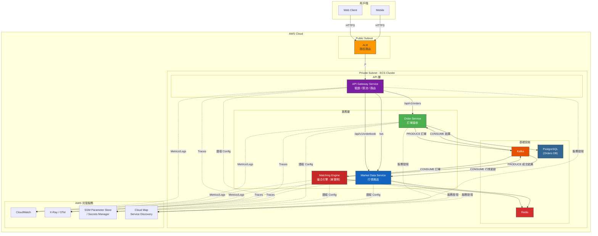
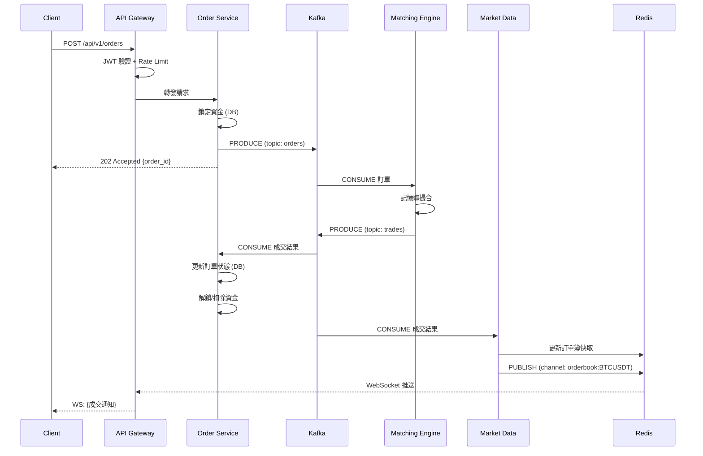
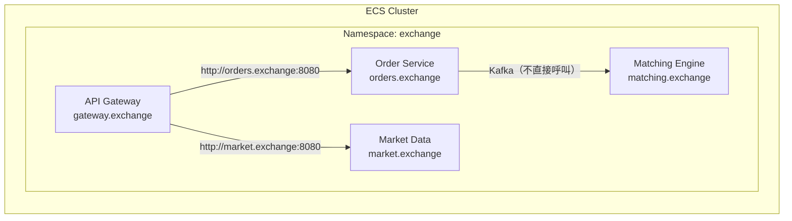

# Phase 7：微服務架構

> 本文件涵蓋將單體拆分為微服務後的**完整架構設計與技術選型分析**。
> 這是學習路線的最終階段，前提是 Phase 1~6 的經驗已累積完成。

---

## 1. 微服務架構全貌



---

## 2. 服務拆分設計

### 2.1 四個 ECS Service

| Service                 | 職責                             | 實例數          | Scaling 策略           |
| ----------------------- | -------------------------------- | --------------- | ---------------------- |
| **API Gateway**         | 驗證 JWT、Rate Limit、路由轉發   | 2~10            | CPU > 70%              |
| **Order Service**       | 接收訂單、鎖定資金、管理訂單狀態 | 2~5             | CPU > 70%              |
| **Matching Engine**     | 撮合邏輯（記憶體訂單簿）         | **1**（單實例） | **不 Scale**（有狀態） |
| **Market Data Service** | 訂單簿快照、K 線、WebSocket 推送 | 2~10            | 連線數                 |

> [!WARNING]
> **Matching Engine 只能跑 1 個實例。** 它在記憶體中維護訂單簿狀態，多實例會造成狀態不一致。如果需要高可用，使用 Hot-Standby 模式（備援實例接收相同 Kafka 訊息但不處理，主實例掛掉時接管）。

### 2.2 訂單處理流程（跨服務）



---

## 3. API Gateway 選型

### 3.1 三種方案比較

| 維度          | ALB 路徑路由          | AWS API Gateway                       | 自建 Go Gateway            |
| ------------- | --------------------- | ------------------------------------- | -------------------------- |
| **原理**      | ALB Rules 按 URL 轉發 | AWS 託管 API 代理                     | 自己寫 reverse proxy       |
| **路由能力**  | 路徑 + Host           | 路徑 + Method + Header                | 完全自訂                   |
| **限流**      | ❌ 無內建             | ✅ 內建 Throttling                    | 自建（Redis Token Bucket） |
| **JWT 驗證**  | ❌                    | ✅ Cognito / Lambda Authorizer        | 自建 middleware            |
| **WebSocket** | ✅ 透傳               | ⚠️ 需用 WebSocket API（不同產品）     | ✅ 完全控制                |
| **費用**      | ~$20/月 (ALB)         | REST: $3.5/百萬請求 + $1/百萬 WS 訊息 | 只有 ECS Task 費用         |
| **延遲**      | ~1ms                  | ~10-30ms                              | ~0.5ms                     |
| **學習價值**  | ⭐                    | ⭐⭐                                  | ⭐⭐⭐                     |

### 3.2 推薦方案

```
Phase 4~6（單體 + ALB）：
  ALB 路徑路由就夠，不需要額外 Gateway

Phase 7（微服務 — 學習版）：
  自建 Go Gateway（ECS Service）
  → 學習 reverse proxy、JWT middleware、rate limiting
  → 用 ALB → Gateway → 各 Service

Phase 7（微服務 — 生產版）：
  AWS API Gateway + ALB
  → API Gateway 做認證 + 限流 + API 版本管理
  → ALB 做內部路由
```

**學習階段推薦自建 Go Gateway**，因為：

1. 面試可以講「我自己寫了 API Gateway，包含 JWT 驗證和 Token Bucket 限流」
2. 學到 reverse proxy、middleware chain、graceful shutdown
3. 未來要換成 AWS API Gateway 也很容易（只是把邏輯搬到託管服務）

---

## 4. Service Discovery 選型

### 4.1 服務間怎麼找到彼此？

| 方案                    | 原理             | 設定難度    | 適合場景                 |
| ----------------------- | ---------------- | ----------- | ------------------------ |
| **環境變數直連**        | 寫死 hostname/IP | ⭐ 最簡單   | 固定少量服務             |
| **ECS Service Connect** | ECS 原生 mesh    | ⭐⭐ 中等   | ECS 內部通訊（推薦）     |
| **Cloud Map (DNS)**     | AWS 託管服務發現 | ⭐⭐ 中等   | 跨 VPC 或 EC2 + ECS 混用 |
| **Consul / Eureka**     | 第三方服務發現   | ⭐⭐⭐ 複雜 | 多雲/混合雲              |

### 4.2 ECS Service Connect（推薦）



**ECS Service Connect 的優勢：**

- 每個 Service 有邏輯名稱（如 `orders.exchange`），不需要知道 IP
- ECS 自動注入 Envoy sidecar 做負載均衡
- 內建 retry、timeout、circuit breaker
- 不需要改程式碼，只需要設定 ECS Task Definition

```json
// ECS Task Definition 片段
{
  "serviceConnectConfiguration": {
    "enabled": true,
    "namespace": "exchange",
    "services": [
      {
        "portName": "http",
        "discoveryName": "orders",
        "clientAliases": [
          {
            "port": 8080,
            "dnsName": "orders.exchange"
          }
        ]
      }
    ]
  }
}
```

---

## 5. Config 管理選型

### 5.1 四種方案比較

| 方案                    | 用途           | 存取方式          | 費用                         | 適合儲存                         |
| ----------------------- | -------------- | ----------------- | ---------------------------- | -------------------------------- |
| **環境變數**            | 最基本         | ECS Task Def 裡寫 | 免費                         | 非敏感設定                       |
| **SSM Parameter Store** | Key-Value 設定 | AWS SDK / CLI     | 標準免費，進階 $0.05/萬次    | Feature Flag、URL、非敏感 Config |
| **Secrets Manager**     | 敏感資訊專用   | AWS SDK / CLI     | $0.40/secret/月 + $0.05/萬次 | DB 密碼、API Key、JWT Secret     |
| **.env 檔**             | 本地開發       | 讀檔              | 免費                         | 本地環境變數                     |

### 5.2 推薦策略

```
本地開發：
  .env 檔 → Docker Compose 讀取

Phase 1~4（單體上雲）：
  ECS Task Definition 環境變數 → 夠用

Phase 7（微服務）：
  非敏感 Config → SSM Parameter Store
    /exchange/prod/kafka-brokers
    /exchange/prod/redis-url
    /exchange/prod/feature-flags/async-order

  敏感資訊 → Secrets Manager
    exchange/prod/db-password
    exchange/prod/jwt-secret
    exchange/prod/api-keys

  ECS Task Definition 引用：
```

```json
// ECS Task Definition 片段 — 從 SSM/Secrets 注入環境變數
{
  "containerDefinitions": [
    {
      "secrets": [
        {
          "name": "DATABASE_PASSWORD",
          "valueFrom": "arn:aws:secretsmanager:ap-northeast-1:123456:secret:exchange/prod/db-password"
        }
      ],
      "environment": [
        {
          "name": "KAFKA_BROKERS",
          "valueFrom": "arn:aws:ssm:ap-northeast-1:123456:parameter/exchange/prod/kafka-brokers"
        }
      ]
    }
  ]
}
```

> [!IMPORTANT]
> **不要在 ECS Task Definition 裡明文寫密碼。** 用 Secrets Manager 引用，ECS 會在啟動 Task 時自動注入，且在 Console 上看不到明文。

---

## 6. 服務間通訊選型

### 6.1 同步 vs 非同步

| 模式       | 技術        | 延遲 | 耦合度         | 適合場景                                |
| ---------- | ----------- | ---- | -------------- | --------------------------------------- |
| **同步**   | HTTP / gRPC | 低   | 高（直接依賴） | Gateway → Order Service（需要立即回應） |
| **非同步** | Kafka Event | 較高 | 低（解耦）     | Order → Matching Engine（可以排隊等）   |

### 6.2 gRPC vs HTTP

| 維度           | gRPC                 | HTTP REST     |
| -------------- | -------------------- | ------------- |
| **序列化**     | Protobuf（二進位）   | JSON（文字）  |
| **效能**       | 快 2~5 倍            | 一般          |
| **型別安全**   | ✅ `.proto` 定義     | ❌ 需手動維護 |
| **瀏覽器支援** | ❌（需 gRPC-Web）    | ✅            |
| **除錯**       | ⚠️ 需工具（grpcurl） | ✅ curl 就行  |
| **負載均衡**   | 需 L7（ALB / Envoy） | L4/L7 都行    |
| **學習曲線**   | ⭐⭐⭐ 較陡          | ⭐ 簡單       |

**推薦策略：**

- **外部 API（Client → Gateway）**：HTTP REST（瀏覽器友善）
- **內部服務（Gateway → Order Service）**：Phase 7 初期用 HTTP，後續可改 gRPC
- **事件驅動（Order → Matching）**：Kafka（已在 Phase 5 建立）

---

## 7. 可靠性模式

### 7.1 Circuit Breaker（熔斷器）

```
正常狀態（CLOSED）：
  Gateway → Order Service ✅ 成功  →  繼續

錯誤累積（OPEN）：
  連續 5 次失敗 → 熔斷 → 直接回傳 503，不再打 Order Service
  → 等 10 秒後進入 HALF-OPEN

半開狀態（HALF-OPEN）：
  允許 3 個請求通過試探
  → 成功 → 回到 CLOSED
  → 失敗 → 回到 OPEN
```

```go
// 推薦使用 sony/gobreaker
import "github.com/sony/gobreaker"

cb := gobreaker.NewCircuitBreaker(gobreaker.Settings{
    Name:        "order-service",
    MaxRequests: 3,                   // HALF-OPEN 時允許 3 個請求
    Interval:    10 * time.Second,    // 統計週期
    Timeout:     30 * time.Second,    // OPEN 持續時間
    ReadyToTrip: func(counts gobreaker.Counts) bool {
        return counts.ConsecutiveFailures > 5  // 連續 5 次失敗觸發
    },
})
```

### 7.2 Retry（重試策略）

| 策略                                | 適合                   | 不適合                   |
| ----------------------------------- | ---------------------- | ------------------------ |
| **指數退避（Exponential Backoff）** | 暫時性錯誤（網路抖動） | 業務邏輯錯誤（餘額不足） |
| **固定間隔**                        | 簡單場景               | 高併發（會雪崩）         |
| **不重試**                          | 非冪等操作             | -                        |

```
重試邏輯：
  500 Internal Error → 重試（最多 3 次，指數退避 100ms/200ms/400ms）
  502/503/504       → 重試
  400 Bad Request   → 不重試（業務錯誤）
  429 Too Many Req  → 等 Retry-After 標頭的時間後重試
```

### 7.3 Timeout 層級

```
用戶 → ALB：60 秒（ALB idle timeout）
ALB → Gateway：30 秒
Gateway → Order Service：10 秒
Order Service → DB：5 秒
Order Service → Kafka：3 秒

原則：外層 > 內層，確保 timeout 從內到外逐層放大
```

---

## 8. 日誌收集策略

### 8.1 CloudWatch Logs vs EFK

| 維度     | CloudWatch Logs                 | EFK (Elasticsearch + Fluentd + Kibana) |
| -------- | ------------------------------- | -------------------------------------- |
| **設定** | ECS 自動整合                    | 需部署 3 個組件                        |
| **搜尋** | CloudWatch Insights（SQL-like） | Kibana（強大全文搜尋）                 |
| **費用** | $0.50/GB 存入 + $0.005/GB 存儲  | 自管 EC2 費用                          |
| **保留** | 可設 1 天 ~ 永久                | 依 ES 磁碟                             |
| **適合** | Phase 4~7（簡單好用）           | 大規模生產環境                         |

**推薦：CloudWatch Logs。** ECS on Fargate 自動送 Log 到 CloudWatch，零設定。EFK 太重，學習階段不值得。

### 8.2 結構化日誌

```go
// 推薦用 slog（Go 1.21+ 內建）
import "log/slog"

logger := slog.New(slog.NewJSONHandler(os.Stdout, nil))

// 結構化輸出，CloudWatch Insights 可以查詢 JSON 欄位
logger.Info("order placed",
    "order_id", orderID,
    "user_id", userID,
    "symbol", "BTCUSDT",
    "side", "buy",
    "latency_ms", latency,
)

// CloudWatch Insights 查詢範例：
// fields @timestamp, order_id, latency_ms
// | filter latency_ms > 1000
// | sort @timestamp desc
// | limit 20
```

---

## 9. 微服務拆分順序建議

不要一次全拆，按優先級逐步拆：

```
Step 1：拆 Market Data Service（最簡單）
  理由：無狀態、讀多寫少、可任意 Scale
  驗證：GET /orderbook 延遲下降、可獨立 Scale

Step 2：拆 API Gateway（中等）
  理由：集中化認證/限流，與業務邏輯解耦
  驗證：可獨立部署、更新認證邏輯不影響其他服務

Step 3：拆 Matching Engine（最複雜）
  理由：有狀態、CPU 密集、需要單獨的 Scaling 策略
  驗證：透過 Kafka 與其他服務完全解耦

每拆一步，都要重新壓測，確認：
  - 延遲沒有顯著增加（跨服務通訊的額外成本）
  - 錯誤率沒有上升（網路不穩定引入的新問題）
  - 可以獨立 Scale 和部署
```

---

## 10. 完整費用估算

| 組件                    | 規格                   | 月費         |
| ----------------------- | ---------------------- | ------------ |
| API Gateway Task x2     | Fargate 0.25vCPU/0.5GB | ~$15         |
| Order Service Task x2   | Fargate 0.5vCPU/1GB    | ~$30         |
| Matching Engine Task x1 | Fargate 1vCPU/2GB      | ~$30         |
| Market Data Task x2     | Fargate 0.25vCPU/0.5GB | ~$15         |
| ALB                     | 1 個                   | ~$20         |
| RDS PostgreSQL          | db.t3.small            | ~$30         |
| ElastiCache Redis       | cache.t3.micro         | ~$25         |
| MSK Kafka               | kafka.t3.small x2      | ~$80         |
| CloudWatch Logs         | ~5GB/月                | ~$5          |
| X-Ray                   | 學習量                 | ~$5          |
| **總計**                |                        | **~$255/月** |

> [!CAUTION]
> **微服務的費用是單體的 3~5 倍。** 這就是為什麼不該過早拆微服務。只有在壓測數據明確指出「某個模組是瓶頸，需要獨立 Scale」時才拆。

---

## 11. 學習成果自我檢核

完成 Phase 7 後，你應該能回答以下所有問題：

| 主題              | 問題                                                         |
| ----------------- | ------------------------------------------------------------ |
| 服務拆分          | 你根據什麼指標決定拆微服務？拆太早有什麼代價？               |
| API Gateway       | ALB 路由 vs AWS API Gateway vs 自建 Gateway 各適合什麼場景？ |
| Service Discovery | ECS Service Connect 和 Cloud Map 的差異？什麼時候用哪個？    |
| Config 管理       | 環境變數、SSM Parameter Store、Secrets Manager 分別存什麼？  |
| 通訊模式          | 什麼場景用 HTTP，什麼場景用 Kafka，什麼場景用 gRPC？         |
| 可靠性            | Circuit Breaker、Retry、Timeout 各防禦什麼故障？             |
| 監控              | CloudWatch、Prometheus、X-Ray 三者如何互補？                 |
| 費用              | 微服務比單體貴多少？如何控制成本？                           |
