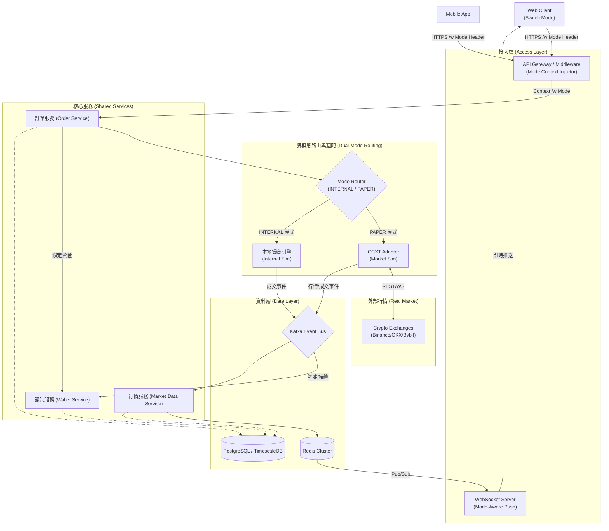
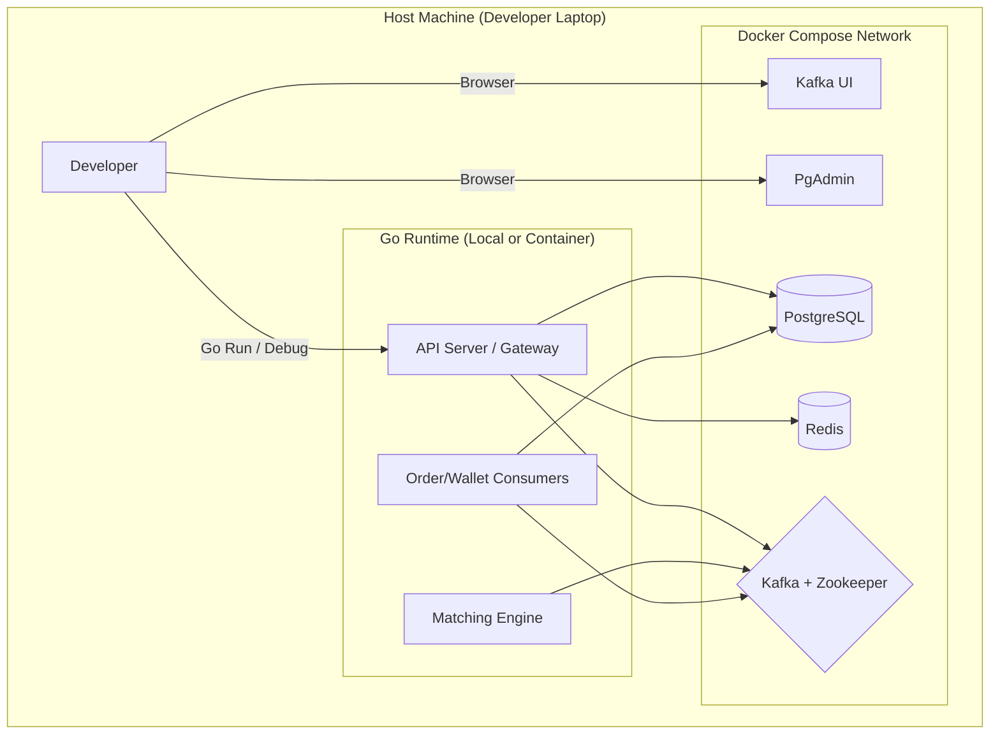
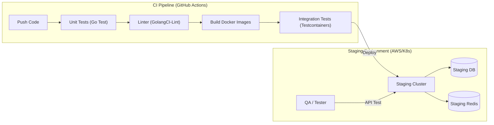
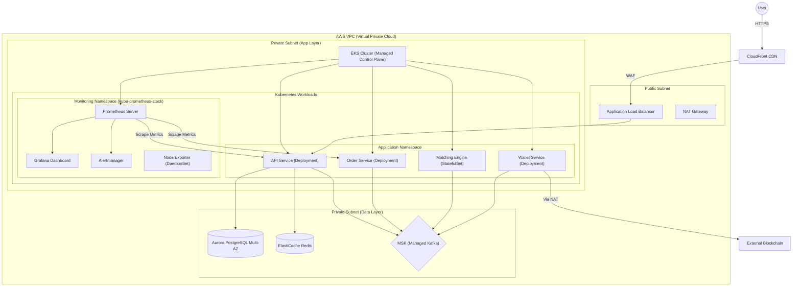

# System Design & Architecture

這份文件詳細描述了加密貨幣交易所 (Crypto Exchange) 的系統架構設計，包含功能架構與各環境的部署架構。

## 1. 功能架構圖 (Functional Architecture - Dual-Mode)

這張圖展示了交易所的核心功能模組，特別強調了 **Dual-Mode（系統模擬 vs 市場模擬）** 的雙軌並行設計。

### 核心模組功能說明

1.  **接入層 (Access Layer)**
    - **API Gateway / Middleware**: 除了路由與驗證，新增 **Trading Mode Middleware**，負責從 Header (`X-Trading-Mode`) 提取模式資訊並注入 Context。
    - **WebSocket Server**: 根據用戶訂閱的模式，推送對應來源的行情數據（本地 vs 真實）。

2.  **雙模態路由與適配 (Dual-Mode Routing)**
    - **Mode Router**: 系統的核心分流器。根據 Context 中的模式切換邏輯路徑。
    - **本地撮合引擎 (Internal Sim)**: 高效能的本地對盤系統，完全可控，用於系統壓力測試與離線開發。
    - **CCXT 適配層 (Market Sim)**: 接入外部交易所真實行情。提供 Paper Trading 功能，讓用戶在真實市場環境下進行策略驗證。

3.  **核心服務 (Shared Services)**
    - **Order Service (訂單服務)**: 統籌訂單生命週期，不感知具體撮合細節，透過 Router 轉發。
    - **Wallet Service (錢包服務)**: 管理不同模式下的資產。INTERNAL 與 PAPER 模式使用獨立的資金餘額，確保數據隔離。
    - **Market Data Service**: 負責聚合 K 線。根據模式來源（本地成交 vs CCXT KLines）生成 OHLCV 數據並存入時序資料庫。

4.  **基礎設施 (Infrastructure)**
    - **Kafka**: 統一事件匯流排。無論來自本地引擎或 CCXT 的事件都標準化後推入 Kafka，實現消費端模式透明。
    - **PostgreSQL / TimescaleDB**: 儲存層。使用不同 Schema 或 Table Prefix 隔離 INTERNAL 與 PAPER 的交易記錄。

---

## 2. 本地開發環境架構 (Local Development Environment)

本地開發主要依賴 Docker Compose 來快速啟動基礎設施，開發者可以在本機直接運行 Go 服務或將其容器化。

### 本地環境特點

- **全端模擬**: 使用 Docker Compose 一鍵啟動所有依賴 (DB, Cache, MQ)。
- **開發便利**: Go 服務可直接在 IDE (VS Code) 中運行與除錯，連接 Docker 中的基礎設施。
- **可視化工具**: 內建 Kafka UI 與 PgAdmin，方便觀察資料流與 DB 狀態。

---

## 3. 測試環境架構 (Test Environment Architecture)

測試環境分為 CI/CD 自動化測試與 Staging 整合測試環境，確保程式碼品質與系統穩定性。

### 測試策略

1.  **單元測試 (Unit Test)**: 針對 Service 層與 Domain 層進行邏輯測試，使用 Mock 隔離外部依賴。
2.  **整合測試 (Integration Test)**: 使用 Testcontainers 啟動真實的 Postgres/Redis/Kafka 容器，驗證 Repository 層與訊息傳遞。
3.  **Staging 環境**: 部署至與生產環境相似的雲端環境，進行端對端 (E2E) 測試與壓力測試。

---

## 4. AWS 生產環境架構 (AWS Production Architecture)

生產環境採用高可用 (High Availability) 設計，基於 Amazon EKS (Elastic Kubernetes Service) 實現容器編排，並使用 kube-prometheus-stack 進行全面監控。

### 雲端架構亮點

- **Kubernetes 原生架構**:

  - **EKS Managed Control Plane**: AWS 託管的 Kubernetes 控制平面，免除 Master Node 維運負擔。
  - **Helm Charts**: 使用 Helm 管理應用部署，標準化部署流程。
  - **Namespace 隔離**: 應用與監控分離於不同 Namespace，提升安全性與可管理性。

- **可觀測性 (Observability) - kube-prometheus-stack**:

  - **Prometheus**: 自動發現 (ServiceMonitor) 並抓取所有服務的 `/metrics` 端點。
  - **Grafana**: 預建儀表板監控 Kubernetes 叢集狀態、應用效能 (QPS, Latency, Error Rate)。
  - **Alertmanager**: 整合 Slack/PagerDuty，即時告警異常狀態。
  - **Node Exporter**: 以 DaemonSet 形式部署，收集各節點系統指標。

- **高可用性 (HA)**:

  - 資料庫 (RDS) 與 訊息隊列 (MSK) 皆採用 Multi-AZ 部署。
  - EKS Worker Nodes 分散於多個可用區 (AZ)。
  - 使用 Pod Disruption Budget (PDB) 確保滾動更新時服務不中斷。

- **彈性擴展 (Auto Scaling)**:

  - **Horizontal Pod Autoscaler (HPA)**: 根據 CPU/Memory 或自訂指標自動調整 Pod 數量。
  - **Cluster Autoscaler**: 根據 Pending Pods 自動調整 Worker Node 數量。

- **安全性**:
  - **WAF**: 防禦 DDoS 與常見 Web 攻擊。
  - **Private Subnet**: 核心服務與資料庫不直接暴露於公網，僅透過 ALB 與 NAT Gateway 進出。
  - **IRSA (IAM Roles for Service Accounts)**: 細粒度的 Pod 級別權限控制。
  - **Network Policies**: 控制 Pod 間的網路流量。
