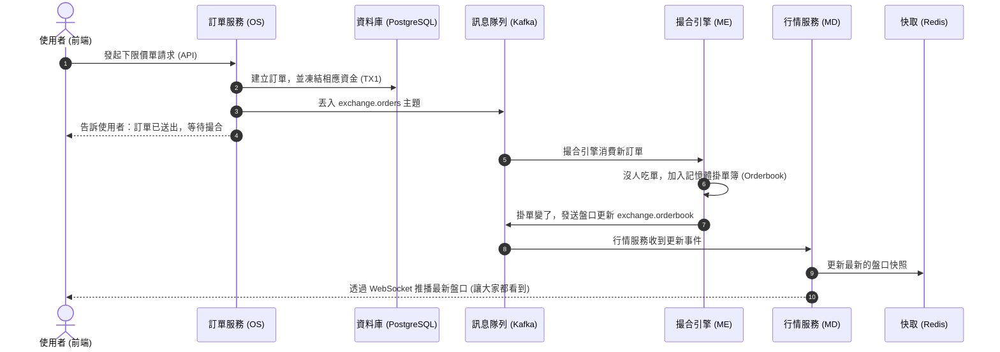
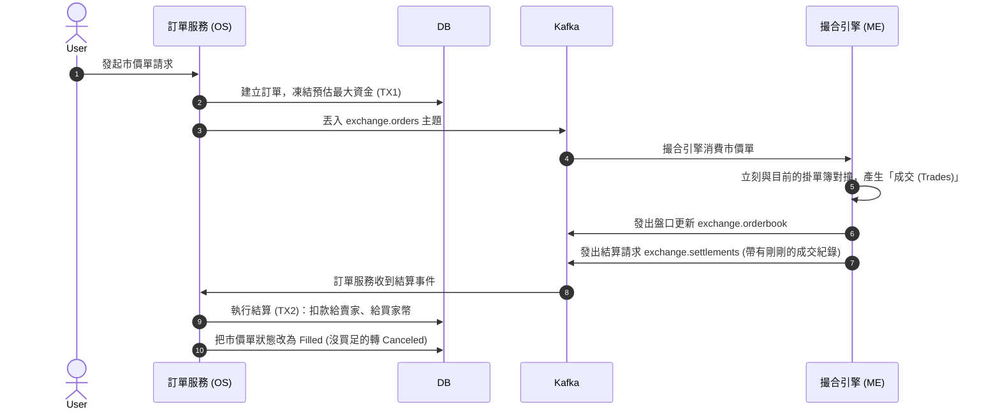
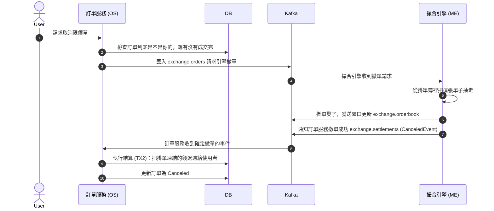
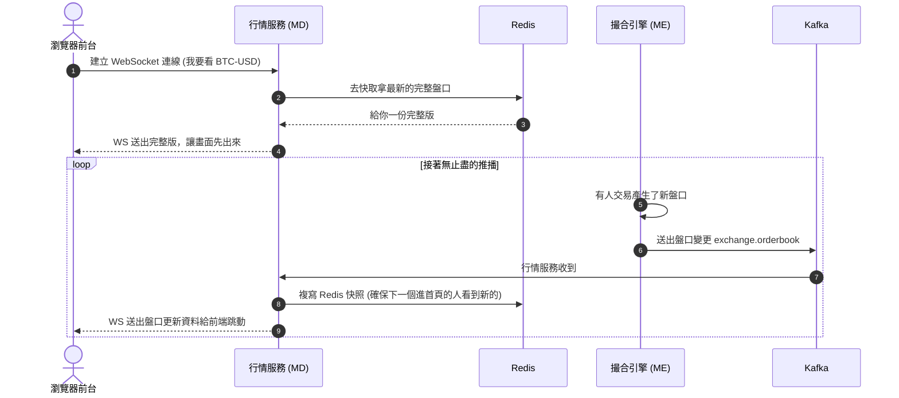
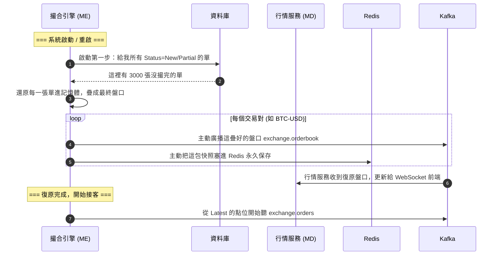
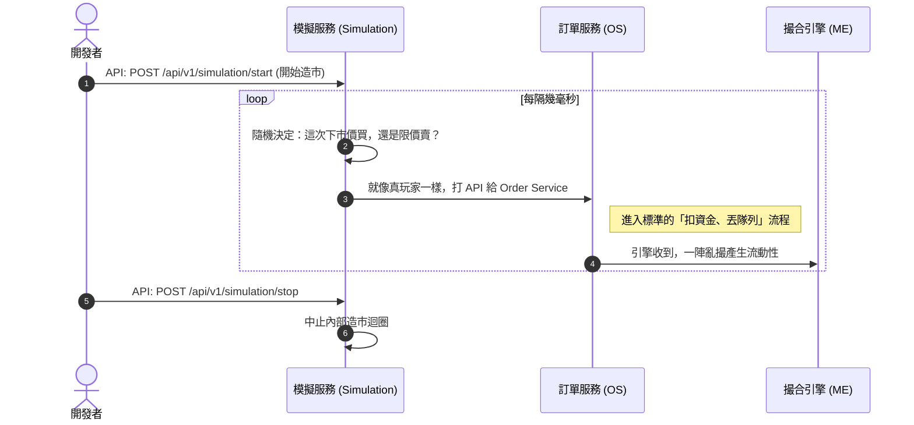

# 微服務交易所系統流程圖解 (淺顯易懂版)

這份文件詳細描述了本系統在六種最常見情境下的運作流程。我們會把**訂單服務 (Order Service)**、**撮合引擎 (Matching Engine)** 與 **行情服務 (Market Data Service)** 這三個核心角色分開來看，讓你清楚知道每個動作「到底是由誰做、什麼時候做」，並搭配循序圖幫助理解。

---

## 1. 下限價單 (Place Limit Order)

**情境**：使用者掛了一張不會馬上全部成交的限價單，這筆單子會被收進系統的掛單簿等待其他人來吃單。

1. **鎖定資金 (TX1)**：訂單服務先在資料庫建立一筆 `Status=New` 的訂單，並把使用者的錢「鎖起來」避免超花。
2. **非同步通知**：把這張新訂單丟入 Kafka (`exchange.orders`)。
3. **記憶體排隊**：撮合引擎收到訂單後，放進自己記憶體裡的掛單簿。因為掛單簿變了，所以立刻發送出盤口更新事件 (`exchange.orderbook`)。
4. **推播給所有人**：行情服務收到更新，會去改寫 Redis 快照，再把最新的盤口畫面透過 WebSocket 廣播給所有開著網頁的人看。

---

## 2. 下市價單 (Place Market Order)

**情境**：使用者不看價格，就是要「現在立刻買到」或「現在立刻賣掉」。市價單不在掛單簿上排隊，沒買完的會直接被系統取消 (Cancel)。

1. **直接撞單**：引擎拿到市價單後，直接去撞記憶體裡的掛單簿，產生一筆或多筆「成交紀錄 (Trade)」。
2. **結算資金 (TX2)**：引擎打包這些成交紀錄發出結算事件 (`exchange.settlements`)。
3. **退還餘額**：訂單服務收到結算請求，把原本多凍結的錢退還、把剛買到的錢加給帳戶，並將訂單狀態改為 `Filled`。

---

## 3. 取消訂單 (Cancel Order)

**情境**：使用者覺得等太久了，想把原本掛在簿子上的限價單抽走。

1. **請求撤單**：訂單服務發送「取消訂單請求」給引擎，但**這時候還沒改變資料庫的狀態**（因為引擎可能剛好把這單撮掉了，引擎說了算）。
2. **引擎拔單**：引擎在記憶體裡找到這單，把它抽掉，並發出 `OrderCanceledEvent` 給訂單服務。
3. **退還資金 (TX2)**：訂單服務收到引擎確認撤單的事件後，把這筆單剩下還沒成交部位的錢，解凍還給使用者，並在資料庫把狀態更新為 `Canceled`。

---

## 4. WebSocket 撈盤口與即時推播

**情境**：前端一打開網頁，畫面需要瞬間顯示當前盤口，之後還要跟著市場跳動。

1. **初始化 (Snapshot)**：一連上，行情服務會先去 Redis 拿完整的一包盤口快照給你。
2. **差異更新 (Delta)**：之後只要引擎有動作（有人下單、撤單），行情服務就會透過 WS 推播給你這一次「動了哪裡」。

---

## 5. 系統重啟 (System Restart)

**情境**：工程師更新了撮合引擎，重啟服務。此時系統要如何找回重啟前大家掛的單子？

1. **Hydration (補水)**：引擎剛起來，還在盲目狀態，先去 PostgreSQL 問「目前狀態還是活躍的限價單有哪些？」。
2. **重建與打快照**：找回資料後，放進記憶體把盤口重疊起來，接著**主動打一份最新的盤口快照送到 Redis 裡**，並透過 Kafka 廣播給行情服務，避免外面看盤是空的。
3. **恢復接單**：從最新的 (`latest`) Kafka offset 開始聽新單子，繼續平常的工作。

---

## 6. 前端觸發模擬器 (Frontend Triggers Simulator)

**情境**：剛起專案沒人玩，利用模擬器腳本來自動「假扮幾百個玩家」亂標價格造市。

1. **啟動模擬**：透過 API 打給 Simulation Service。
2. **腳本迴圈**：模擬器拿著不同的 `User-ID` 與隨機數值產生各種造市單。
3. **化身玩家**：它其實就是一直在偷偷打訂單服務的 API，後面的動作就跟第一、二種情境完全一模一樣。

