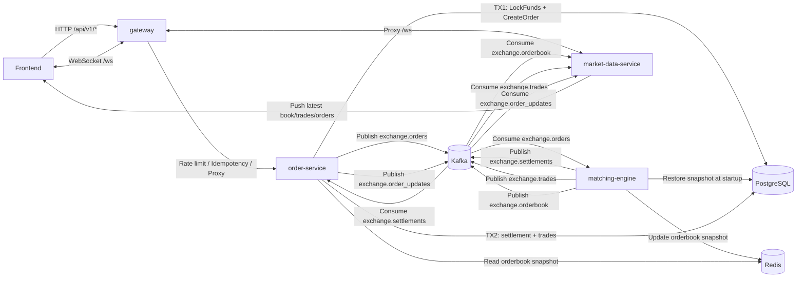

# 微服務架構說明

本文件說明後端如何從單體拆分為 4 個微服務，以及各服務的責任邊界與事件流。

---

## 1. 服務邊界

| 服務 | 職責 |
|:---|:---|
| **gateway** | 對外統一入口、Rate Limit、Idempotency、反向代理 (`/api/v1/*` → order-service, `/ws` → market-data-service) |
| **order-service** | HTTP API、TX1（鎖資金 + 建單）、消費結算事件執行 TX2、發布 `exchange.order_updates` |
| **matching-engine** | 從 DB 恢復活動限價單、消費 `exchange.orders`、執行撮合、發布 settlements / trades / orderbook、更新 Redis 快取 |
| **market-data-service** | 維護 WebSocket 長連線、消費 orderbook / trades / order_updates 事件並推播前端 |

---

## 2. 架構圖

---

## 3. Kafka 事件流

| Topic | Producer | Consumer | 用途 |
|:---|:---|:---|:---|
| `exchange.orders` | order-service | matching-engine | 下單事件 |
| `exchange.settlements` | matching-engine | order-service | 撮合結算事件 |
| `exchange.trades` | matching-engine | market-data-service | 成交推播 |
| `exchange.orderbook` | matching-engine | market-data-service | 掛單簿更新推播 |
| `exchange.order_updates` | order-service | market-data-service | 訂單狀態更新推播 |

---

## 4. 跨服務通訊機制

- **Kafka**：解耦服務間的命令與事件傳遞（下單、撮合、結算、推播）
- **Redis**：共享最新 orderbook snapshot，供 order-service 估算市價買單資金（避免讀取空的本地引擎）

---

## 5. 常見問題 Debug 指南

| 問題 | 檢查步驟 |
|:---|:---|
| 下單成功但沒有成交 | 1. gateway 是否代理到 order-service → 2. order-service 是否發 `exchange.orders` → 3. matching-engine 是否消費 → 4. Kafka topic 是否存在 |
| 撮合完成但前端無更新 | 1. matching-engine 是否發 `exchange.orderbook` → 2. market-data-service 是否收到 → 3. gateway `/ws` 代理是否正常 |
| 成交完成但訂單列表未更新 | 1. order-service TX2 是否成功 → 2. 是否發 `exchange.order_updates` → 3. market-data-service 是否消費 |
| 市價買單報流動性不足 | 1. Redis 是否有 `exchange:orderbook:<symbol>` → 2. matching-engine 啟動時是否 warmup → 3. snapshot 中 asks 是否為空 |

---
