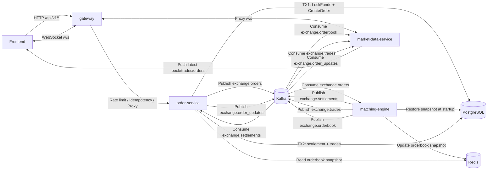
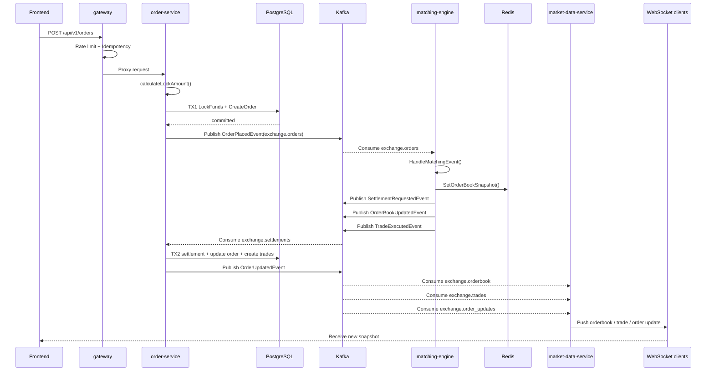
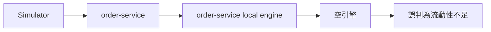
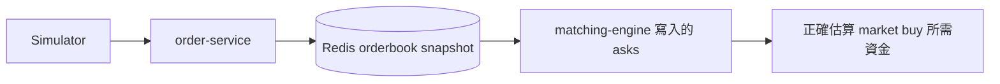

# 微服務拆分教學

本文件說明目前後端如何從單體架構拆成 `gateway`、`order-service`、`matching-engine`、`market-data-service` 四個服務，以及這次拆分背後的設計理由、事件流與除錯方式。

重點不是只看「多了哪幾個執行檔」，而是理解：

1. 單體原本依賴哪些隱含前提
2. 拆成微服務後哪些前提失效
3. 現在改用什麼協作方式補回來
4. 每個服務的責任邊界如何分離

---

## 1. 單體拆分前後的核心差異

### 單體時代

原本 `cmd/server/main.go` 是單體模式，HTTP API、WebSocket、撮合引擎、結算流程都在同一個 process 裡。

這代表：

1. API 收到下單後，可以直接呼叫記憶體撮合引擎
2. 撮合完成後，可以直接呼叫 WebSocket handler 推播前端
3. 估算市價單所需資金時，可以直接讀同一份 in-memory orderbook
4. Rate Limit 與 Idempotency 可以直接掛在 API server 本身

這些在單體裡都很自然，但拆成微服務後就不再成立。

### 微服務時代

現在本地微服務拓樸拆成四個服務：

1. `gateway`
2. `order-service`
3. `matching-engine`
4. `market-data-service`

它們不共享同一份記憶體，所以需要兩種跨服務機制：

1. **Kafka**：傳遞下單、撮合、結算、成交、orderbook、order update 事件
2. **Redis**：共享最新 orderbook snapshot，讓 `order-service` 能估算市價買單資金

另外，這一輪又補上兩個很重要的升級：

1. **Gateway 前移安全機制**：限流與冪等性不再放在 `order-service`，而是在 `gateway` 邊界層處理
2. **WebSocket 從交易核心抽離**：`market-data-service` 專門處理長連線與即時推播，避免 `order-service` 同時扛交易與推播兩種負載

---

## 2. 現在的服務邊界

### gateway 的責任

`cmd/gateway/main.go` 負責：

1. 對外提供統一入口
2. 代理 `/api/v1/*` 到 `order-service`
3. 代理 `/ws` 到 `market-data-service`
4. 前移 Rate Limit 與 Idempotency middleware
5. 在邊界層先擋掉惡意、重複或過量請求

### order-service 的責任

`cmd/order-service/main.go` 負責：

1. 對外提供 HTTP API
2. 執行 TX1：鎖資金 + 建立訂單
3. 將下單請求送進 Kafka
4. 消費結算事件並執行 TX2
5. 發布 `exchange.order_updates`
6. 提供 simulator 的進入點

### matching-engine 的責任

`cmd/matching-engine/main.go` 負責：

1. 啟動時從 DB 恢復活動限價單到記憶體引擎
2. 消費 `exchange.orders`
3. 執行真正的撮合
4. 發布 `exchange.settlements`
5. 發布 `exchange.trades`
6. 發布 `exchange.orderbook`
7. 初始化 Kafka topics（包含 `exchange.order_updates`）
8. 更新 Redis orderbook 快取

它不直接提供下單 API，也不直接管理 WebSocket。

### market-data-service 的責任

`cmd/market-data-service/main.go` 負責：

1. 維護 WebSocket 長連線
2. 消費 `exchange.orderbook`
3. 消費 `exchange.trades`
4. 消費 `exchange.order_updates`
5. 將最新市場資料與訂單更新推播給前端

它不直接提供下單 API，也不做交易結算，只專注在即時推播。

---

## 3. 整體架構圖

---

## 4. 下單成功時序圖

---

## 5. 這次改動的核心 Go 檔與邏輯

## 5.1 `internal/core/exchange_service.go`

### 改動重點：`OnOrderBookUpdate()` 變成雙模式

這個函式原本更像「有 orderbook 更新時就直接通知前端」。

但拆成微服務後，`matching-engine` 沒有 WebSocket handler，所以現在它必須分成兩種模式：

1. **同進程模式**：如果有 `tradeListener`，就直接呼叫 `tradeListener.OnOrderBookUpdate(snapshot)`
2. **微服務模式**：如果沒有 `tradeListener`，但有 `eventBus`，就發 `OrderBookUpdatedEvent` 到 Kafka

此外，它現在一進來就先非同步更新 Redis 快取：

1. 讓前端查 orderbook 時可以直接從 Redis 拿資料
2. 讓 `order-service` 在估算市價買單資金時，能讀到 `matching-engine` 的最新賣盤

### 為什麼這樣改

因為現在 orderbook 更新不一定發生在有 WebSocket 的那台服務上。

在單體時代：

1. 撮合引擎與 WebSocket 在同一個 process
2. 可以直接推送

在目前微服務時代：

1. 撮合引擎在 `matching-engine`
2. WebSocket 在 `market-data-service`
3. 所以只能先發 Kafka 事件，再由 `market-data-service` 轉推

---

## 5.2 `internal/core/orderbook_consumer.go`

### 改動重點：新增 `HandleOrderBookEvent()`

這個 handler 現在主要給 `market-data-service` 使用。

它做的事情很單純：

1. 從 `exchange.orderbook` 收到 `OrderBookUpdatedEvent`
2. 反序列化 event
3. 呼叫 `s.OnOrderBookUpdate(event.Snapshot)`

但這個「再呼叫一次」非常關鍵。

因為：

1. 在 `matching-engine` 中呼叫 `OnOrderBookUpdate()` 的意思是「發 Kafka」
2. 在 `market-data-service` 中呼叫 `OnOrderBookUpdate()` 的意思是「推 WebSocket」

同一個函式，因為注入的依賴不同，所以行為不同。

---

## 5.3 `internal/core/order_service.go`

這個檔有兩個最重要的改動。

### 第一個改動：`PlaceOrder()` 支援 Kafka 非同步撮合

`PlaceOrder()` 現在的流程是：

1. 正規化輸入（symbol、price、quantity）
2. 計算需要鎖定的資金
3. 建立訂單 ID 與初始狀態
4. 執行 TX1：`LockFunds + CreateOrder`
5. 如果有 Kafka：發 `OrderPlacedEvent`
6. 如果沒有 Kafka：退回單體同步撮合模式

所以現在 `PlaceOrder()` 已經不是「下單後直接在本地記憶體引擎撮合」，而是：

1. 先把交易前置條件寫進 DB
2. 再把撮合請求交給 Kafka

### 第二個改動：修正市價買單資金估算來源

以前市價買單估算資金時，直接讀本地記憶體撮合引擎。這在單體是合理的，因為 API server 與撮合引擎在一起。

但現在：

1. 真正有完整 orderbook 的是 `matching-engine`
2. `order-service` 在微服務模式下不會 restore 本地引擎
3. 所以 `order-service` 的本地 engine 其實是空的

所以現在新增：

1. `estimateMarketBuyFunds()`
2. `estimateFromSnapshotAsks()`

微服務模式下優先從 Redis 讀最新 orderbook snapshot，Redis miss 才 fallback 到本地記憶體引擎。

---

## 5.4 `internal/core/events.go`

### 改動重點：把 Kafka 契約集中定義在 Core

這裡定義了目前微服務拆分最重要的 topic 與 event payload。

主要 topic：

1. `exchange.orders`
2. `exchange.settlements`
3. `exchange.trades`
4. `exchange.orderbook`
5. `exchange.order_updates`

### 事件流向

1. `order-service` 發 `exchange.orders`
2. `matching-engine` 消費 `exchange.orders`
3. `matching-engine` 發 `exchange.settlements`
4. `matching-engine` 發 `exchange.trades`
5. `matching-engine` 發 `exchange.orderbook`
6. `order-service` 消費 `exchange.settlements`
7. `order-service` 發 `exchange.order_updates`
8. `market-data-service` 消費 `exchange.orderbook`
9. `market-data-service` 消費 `exchange.trades`
10. `market-data-service` 消費 `exchange.order_updates`

這個檔的重要性在於：

**它不是只有常數而已，而是整個事件驅動架構的契約中心。**

---

## 5.5 `internal/infrastructure/kafka/producer.go`

### 改動重點：新增 `CreateTopics()`

這次看到的 `UNKNOWN_TOPIC_OR_PARTITION` 問題，根本原因不是程式 publish 寫錯，而是 broker 端沒有 topic。

所以現在服務啟動時會主動送 `CreateTopicsRequest`，顯式建立需要的 topic，避免依賴 broker 的 server-side auto create 設定。

這樣的結果是：

1. 啟動流程更可預期
2. 不會因為 topic 還沒建立而讓整條事件鏈中斷

---

## 5.6 `cmd/matching-engine/main.go`

### 這個入口檔做了什麼

它現在會：

1. 連 DB
2. 建 Repository
3. 連 Redis
4. 建 Kafka Producer
5. 建 `ExchangeService`
6. `RestoreEngineSnapshot()`
7. `CreateTopics()`
8. 預熱 Redis orderbook cache
9. 啟動 `exchange.orders` consumer
10. 提供 `/health`

### 為什麼要預熱 Redis

假設剛啟動時：

1. `matching-engine` 已從 DB 恢復出一堆限價掛單
2. 但 Redis 還沒有最新 snapshot
3. 此時如果 `order-service` 立刻來一筆市價買單
4. 它去查 Redis 會 miss

所以 `matching-engine` 啟動完成後，會先呼叫一次 `svc.GetOrderBook()`，把目前引擎狀態寫進 Redis，避免冷啟動空窗。

---

## 5.7 `cmd/order-service/main.go`

### 這個入口檔做了什麼

它現在會：

1. 連 DB
2. 跑 migration
3. 連 Redis
4. 建 Kafka Producer
5. 建 `ExchangeService`
6. 啟動 settlement consumer
7. 啟動 simulator
8. 起 HTTP API

### 為什麼這裡不再維護 WebSocket

因為 WebSocket 已經拆給 `market-data-service`：

1. `order-service` 不再維護長連線
2. `orderbook`、`trade`、`order update` 推播改由 market-data-service 專職處理
3. 交易服務專注在 DB / TX1 / TX2 / Kafka 事件

### 為什麼這裡不 restore engine snapshot

正常微服務模式下，`order-service` 不應該持有真正的撮合引擎狀態。

原因是：

1. 真正負責撮合的是 `matching-engine`
2. 若兩邊都維護完整引擎，容易出現雙寫與狀態分裂

所以 `order-service` 只在 Kafka 不可用時，才退回同步模式並 restore snapshot。

---

## 5.8 `cmd/market-data-service/main.go`

### 這個入口檔做了什麼

它現在會：

1. 建 WebSocket handler
2. 建只負責 relay 的 `ExchangeService`
3. 消費 `exchange.orderbook`
4. 消費 `exchange.trades`
5. 消費 `exchange.order_updates`
6. 起 `/ws` 與 `/health`

### 為什麼要多這個服務

因為 WebSocket 是長連線、記憶體密集型；交易結算是 DB / CPU / I/O 密集型。把它們拆開後：

1. 市場波動造成的推播暴增，不會直接把交易核心一起拖垮
2. WebSocket 擴容可以獨立進行
3. `order-service` 的資源模型變得更單純

---

## 6. 為什麼現在同一份程式碼能同時支援單體與微服務

關鍵不是寫兩套 business logic，而是利用依賴注入把行為切開。

例如 `NewExchangeService(...)` 注入了：

1. `tradeListener`
2. `cacheRepo`
3. `eventBus`

這三個依賴是否存在，會直接改變執行路徑。

### 在 order-service 中

1. `tradeListener = nil`
2. `cacheRepo = Redis`
3. `eventBus = Kafka producer`

結果：

1. 不直接推 WebSocket
2. 可以查 Redis 快取
3. 可以發 Kafka（下單與 order update）

### 在 matching-engine 中

1. `tradeListener = nil`
2. `cacheRepo = Redis`
3. `eventBus = Kafka producer`

結果：

1. 不會直接推 WebSocket
2. 會更新 Redis
3. 會把 orderbook 變化發布到 Kafka

### 在 market-data-service 中

1. `tradeListener = wsHandler`
2. `cacheRepo = nil`
3. `eventBus = nil`

結果：

1. 專心把 Kafka 事件轉成 WebSocket 訊息
2. 不碰 DB / Redis / 核心撮合
3. 即使推播服務掛掉，也不會直接拖垮交易核心

---

## 7. 模擬交易之前為什麼失敗

之前出錯訊息是：

1. `市價單預估資金失敗`
2. `insufficient liquidity to fulfill market buy`

表面看起來像市場沒有流動性，但其實不是市場真的沒單，而是 `order-service` 看的不是 `matching-engine` 的 orderbook。

### 舊錯誤流程

### 修正後流程

---

## 8. 實務上怎麼用這份理解去 debug

如果你之後遇到問題，可以先判斷是哪一層出了錯。

### 問題類型 1：下單 API 成功，但沒有成交

先檢查：

1. `gateway` 是否有把請求代理到 `order-service`
2. `order-service` 是否成功發 `exchange.orders`
3. `matching-engine` 是否有消費 `exchange.orders`
4. Kafka topic 是否存在

### 問題類型 2：撮合有做，但前端沒有 orderbook 更新

先檢查：

1. `matching-engine` 是否有發 `exchange.orderbook`
2. `market-data-service` 的 `HandleOrderBookEvent()` 是否有收到
3. `gateway` 是否有把 `/ws` 正確代理到 `market-data-service`
4. `wsHandler` 是否正常推播

### 問題類型 3：成交有完成，但前端訂單列表沒有即時變化

先檢查：

1. `order-service` 的 TX2 是否成功
2. `order-service` 是否有發 `exchange.order_updates`
3. `market-data-service` 是否有消費 `exchange.order_updates`
4. 前端是否有收到 `order_update` 訊息

### 問題類型 4：市價買單直接報流動性不足

先檢查：

1. Redis 是否有 `exchange:orderbook:BTC-USD`
2. `matching-engine` 啟動時是否有 warmup 成功
3. Redis snapshot 中 asks 是否為空

---

## 9. 最後總結

這次修改可以濃縮成六句話：

1. `gateway` 負責對外入口、限流、冪等性與反向代理
2. `order-service` 只負責接單、鎖資金、結算與 order update 事件發布
3. `matching-engine` 專心做撮合，不直接碰前端
4. `market-data-service` 專心做 WebSocket 即時推播
5. Kafka 負責跨服務傳遞命令與結果
6. Redis 負責共享最新 orderbook snapshot，彌補服務之間不共享記憶體的問題

所以這次改動的本質不是單純「多拆兩個服務」，而是把原本單體裡的直接呼叫，重構成事件驅動、共享快取與邊界層防護協作。

只要掌握這個核心，你之後再看 `PlaceOrder()`、`OnOrderBookUpdate()`、`HandleOrderBookEvent()`、`HandleOrderUpdatedEvent()`、`matching-engine/main.go`、`market-data-service/main.go` 就不會再覺得它們是零散修改，而會知道它們其實是同一條微服務事件鏈上的不同節點。