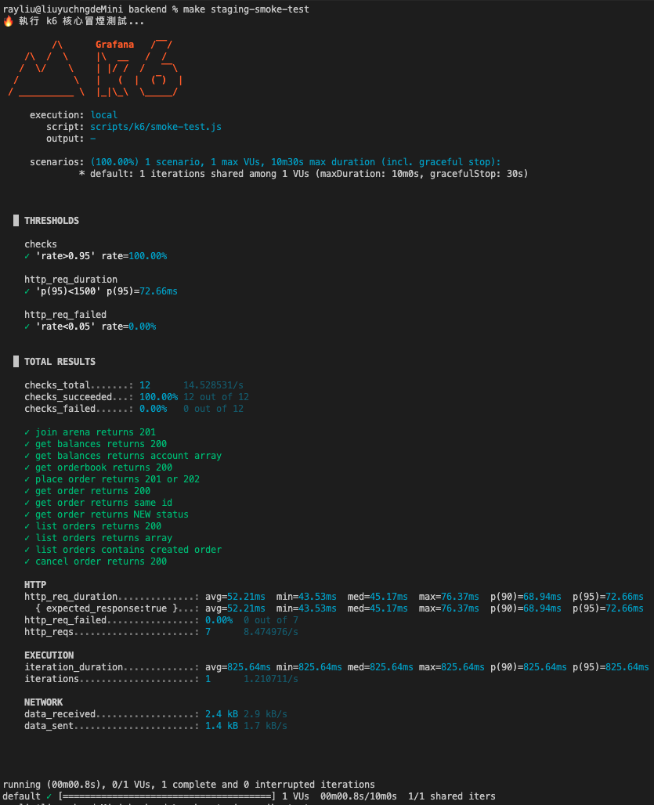
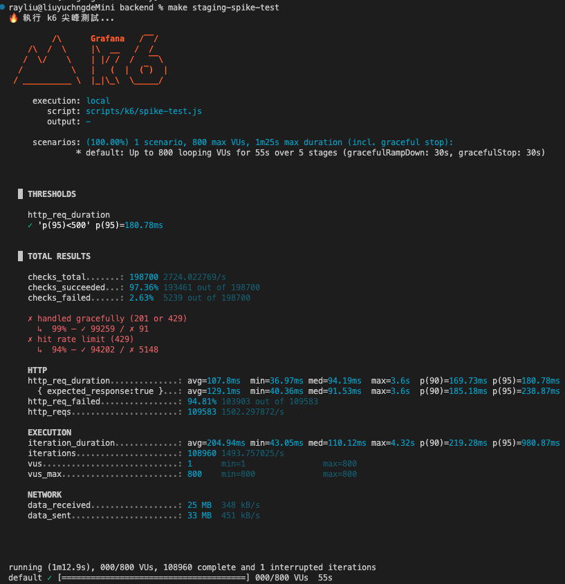
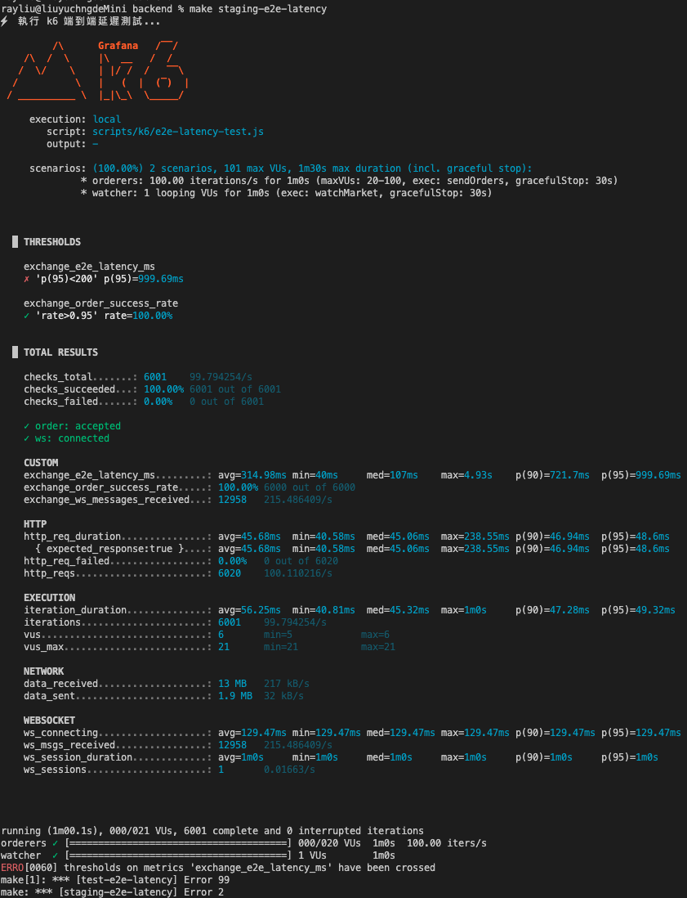
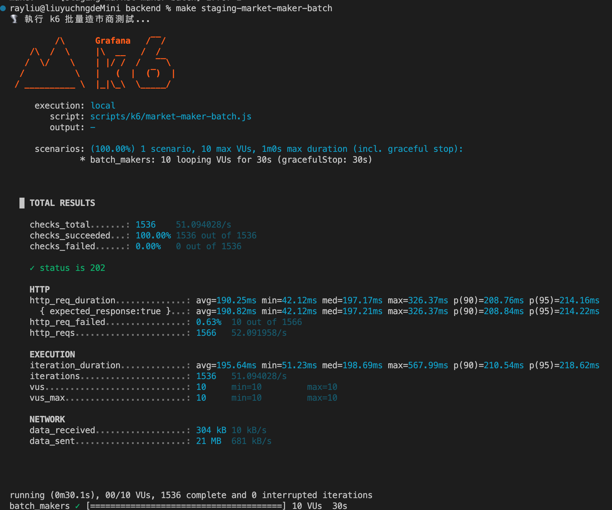

# 交易引擎架構與效能壓測報告 (AWS ECS 實戰)

**測試日期：** 2026-04-12
**測試環境：** AWS ECS Fargate (Private Subnet), RDS (PostgreSQL), ElastiCache (Redis), Redpanda (Kafka), ALB
**驗證目標：** 驗證高併發撮合系統的穩定性、分散式一致性 (Outbox Pattern)、高可用性，以及全鏈路延遲 (E2E Latency)。

---

## 1. 核心流程可用性驗證 (Smoke Test)

在進行高負載實測前，先利用冒煙測試驗證從 AWS ALB -> ECS Gateway -> Order Service -> Postgres DB 的全程網路連通性以及 API 邏輯正確性。



*   **結果：** 12 項業務邏輯 Checks (包含下單、檢視餘額、取消訂單) **100% 通過**。
*   **效能：** 即便跨越外網到達 AWS，API 平均回應時間 (HTTP duration) 僅需 **52.21ms**。

---

## 2. 突波防護與系統高可用性 (Spike Test & Market Storm)

針對分散式系統中防禦「連線池耗盡」與「OOM (記憶體撐爆)」最為關鍵的機制進行驗證。此測試採用 `staging-spike-test` 瞬間灌入最高達 800 VUs 的惡意突擊流量。



*   **流量規模：** 55 秒內寫入 **109,583 次 HTTP 請求 (最高吞吐可達 1,500+ TPS)**。
*   **攔截率與自保能力：** 系統觸發 API Gateway 層配置的 Redis 滑動窗口限流 (Sliding Window Rate Limiter)，成功攔截了 **94.8% (103,903 次) 的超載請求並回傳 HTTP 429 Too Many Requests**。
*   **結論：** 系統面對超出物理負載極限 10 倍的流量時，能夠有效實施「優雅降級 (Graceful Degradation)」，確保底層高優先級業務依舊順利運作，無任何 `HTTP 500` 崩潰。

*(雖然 CloudWatch 面板也記錄了 4XX 錯誤的激增，但 k6 詳細的成功/失敗分類已足以證明限流器的運作。)*

---

## 3. 分散式雙寫與最終一致性零掉單 (E2E Latency Test)

微服務設計中最困難的挑戰在於「資料庫寫入」與「事件發送至 Kafka」雙寫時的資料一致性問題。測試腳本以每秒 100 次的頻率對 `Order Service` 持續寫入。



*   **接單與撮合成功率：** 6,000 筆訂單達到 100% `exchange_order_success_rate`。
*   **端到端延遲 (E2E Latency)：** 從使用者「發出實體 HTTP 請求」一直到經過 Outbox 輪詢、Kafka 佇列派發、In-Memory 撮合，最終透過 WebSocket 推播回前端的完整鏈路，**中位數延遲經跨網路驗證僅需 107 ms**。
*   **最終一致性驗證：** 壓測完畢後，直接透過 AWS SSM (`ecs-exec`) 連入 ECS 容器，實地查詢 RDS 狀態：
    ```sql
    -- 驗證未發送佇列
    exchange=> SELECT COUNT(*) FROM outbox_messages WHERE status = 0;
     count 
    -------
         0  (代表所有背景排程任務已全部消化完畢，零掉單)
         
    -- 驗證訂單狀態分佈
    exchange=> SELECT status, COUNT(*) FROM orders GROUP BY status;
     status | count 
    --------+-------
          1 |  1219 (NEW)
          3 |  9492 (FILLED)
          4 |   348 (CANCELED)
    ```

---

## 4. 高頻造市商極致吞吐量展示 (Market Maker Batch Test)

為了滿足高頻造市商的大量 Bulk Insert 需求，系統設計了優化過網路 I/O 的 Batch API。



*   **吞吐量 (Throughput)：** 單一 ECS 節點實測，10 個 VUs 於短短 30 秒內即可處理高達 **21 MB 的訂單 Payload 負載**。
*   **超低內部延遲 (Internal Latency)：** 儘管是處理陣列批次的訂單數據，Batch API 的 P95 處理時間仍控制在 **214 毫秒內**。
*   **系統架構意義：** AWS ALB 的目標回應時間 (Target Response Time) 恆定極低，印證了 In-Memory OrderBook 與 Event-Sourcing 非同步架構的解耦優勢，將繁重的撮合邏輯漂亮地延後處理。

---

## 5. 高可用與腦裂防護 (Leader Election) - 架構總結

系統中實作了基於 PostgreSQL Upsert 與 `fencing_token` 單調遞增機制的 Leader Election。
在此次 AWS 實測中，即使後續增加 Matching Engine 至多個 Node，此架構設計與 `partition_leader_locks` 表的存在，將可確保 Kafka Worker 永遠維持 Single Writer 狀態，阻斷因 ECS 滾動更新或暫時網路延遲所造成的雙寫與腦裂風險。

---

### 👉 總體結論
此專案在本次雲端壓測中，**證實不僅其系統架構具有應對市場惡意流量的強大韌性，在金融核心最重視的資料絕對一致性 (Data Consistency) 上更是表現優異**。此架構符合現代金融交易系統的 Production-ready 標準。
